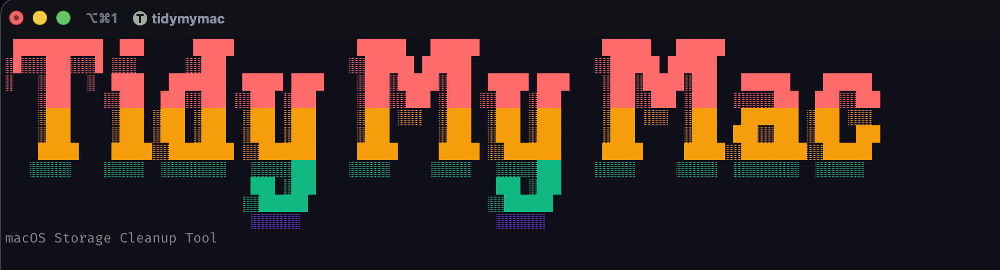

<p align="center">
  
</p>

<h1 align="center">🧹 TidyMyMac</h1>

<p align="center">
  An open-source macOS storage cleanup utility for developers.<br/>
  Scan, review, and reclaim disk space — safely, transparently, and from the terminal.
</p>

## Features

- Interactive TUI to browse and select what to clean
- Dry-run by default — nothing is deleted without your explicit confirmation
- Modular cleaners for different categories of junk
- Progress reporting and summary of reclaimed space
- Export scan results as JSON or CSV
- Generate shell cleanup scripts from scan results
- Target specific categories in any command

## Why TidyMyMac?

macOS can accumulate large amounts of storage in places that are hard to inspect, especially caches, developer artifacts, logs, and vague categories like “System Data”.

TidyMyMac was built to make cleanup transparent and safe:
- inspect first
- review before deleting
- dry-run by default
- stay fully terminal-native

### Cleaners

| Category | What it targets |
|---|---|
| Temporary Files | `/tmp`, `/var/tmp`, user temp directories |
| Application Caches | `~/Library/Caches` |
| System Logs | `~/Library/Logs`, `/Library/Logs`, `/var/log` |
| Homebrew Cache | Packages cached by `brew` |
| Docker Artifacts | Stopped containers, untagged images, orphaned volumes |
| iOS Backups | iPhone/iPad backups in `~/Library/Application Support/MobileSync/Backup` |
| macOS Updates | Old macOS update residues and installers |
| Downloads | Installer files (`.dmg`, `.pkg`) and large items in `~/Downloads` |
| App Orphans | High-confidence leftovers from apps no longer installed |
| Xcode | DerivedData, archives, simulators |
| Development Artifacts | Go build cache and downloaded module cache |
| Time Machine Snapshots | Local Time Machine snapshots stored on disk |
| Trash | Files in the Trash waiting to be permanently removed |

## 🚀 Installation

### Homebrew (recommended)

```bash
brew install viniciussouzao/tap/tidymymac
```

### go install

```bash
go install github.com/viniciussouzao/tidymymac/cmd/tidymymac@latest
```

Make sure `$(go env GOPATH)/bin` is in your `PATH`.

### Build from source

```bash
git clone https://github.com/viniciussouzao/tidymymac
cd tidymymac
make build
./bin/tidymymac
```

> Requires Go 1.21+

## 🛠️ Usage

```bash
# Launch interactive TUI (dry-run, nothing is deleted)
tidymymac

# Actually delete the selected files
tidymymac --execute
```

### TUI Demo

<p align="center">
  
</p>

### CLI Demo

<p align="center">
  
</p>

### 📋 Commands

#### `scan` — identify junk without deleting

```bash
# Interactive table (default)
tidymymac scan

# Scan specific categories only
tidymymac scan docker caches xcode

# Output as JSON or CSV
tidymymac scan --output json
tidymymac scan --output csv

# Include individual file paths in output
tidymymac scan --output json --detailed

# Save output to a timestamped file
tidymymac scan --output csv --save

# Generate a shell cleanup script from scan results
tidymymac scan --generate-script

# Suppress progress output (useful in scripts)
tidymymac scan --output json --quiet
```

#### `clean` — delete junk files

```bash
# Preview what would be deleted (dry-run, default)
tidymymac clean

# Actually delete files
tidymymac clean --execute

# Clean specific categories
tidymymac clean docker caches --execute

# Use a previously saved detailed scan instead of re-scanning
tidymymac clean --from-file scan.json --execute

# Output cleanup result as JSON
tidymymac clean --output json
```

#### Other commands

```bash
tidymymac version   # Print version, commit, build date, platform, and Go version
tidymymac explain   # Explain what each category contains
tidymymac history   # Show past cleanup runs
```

## 🏗️ Development

```bash
make build   # Compile binary to bin/tidymymac
make test    # Run tests with race detection
make run     # Build and run
make clean   # Remove build artifacts
```

## 🔒 Safety

TidyMyMac is designed with safety as the primary concern:

- ✅ **Dry-run by default**: scanning and reviewing never touches your files
- ✅ **Explicit confirmation required**: deletion only happens with `--execute`
- ✅ **No silent operations**: every file is shown before removal
- ✅ **Errors are non-fatal**: a failure on one file won't stop the rest

## 🩺 Troubleshooting

Running into empty scan results, permission issues, or other surprises? Check [docs/TROUBLESHOOTING.md](docs/TROUBLESHOOTING.md) — the most common one is a terminal missing **Full Disk Access** on macOS, which makes Trash and a few other categories report `0 B` even when they aren't empty.

## 📄 License

This project is licensed under the MIT License - see the LICENSE file for details.
