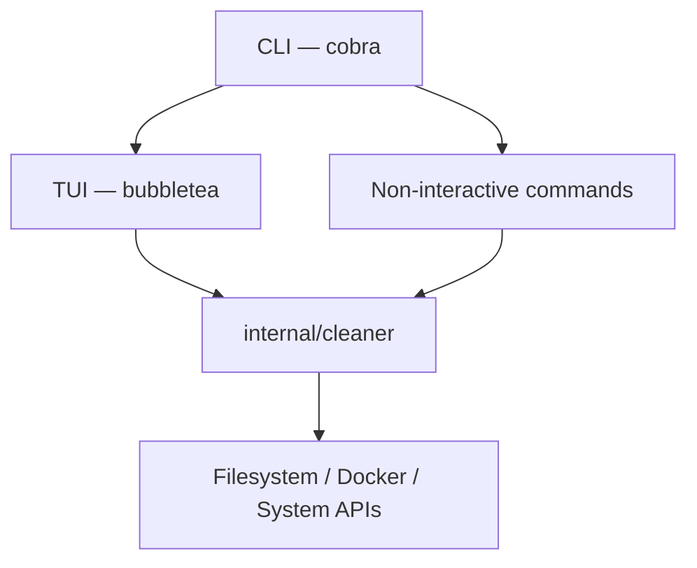
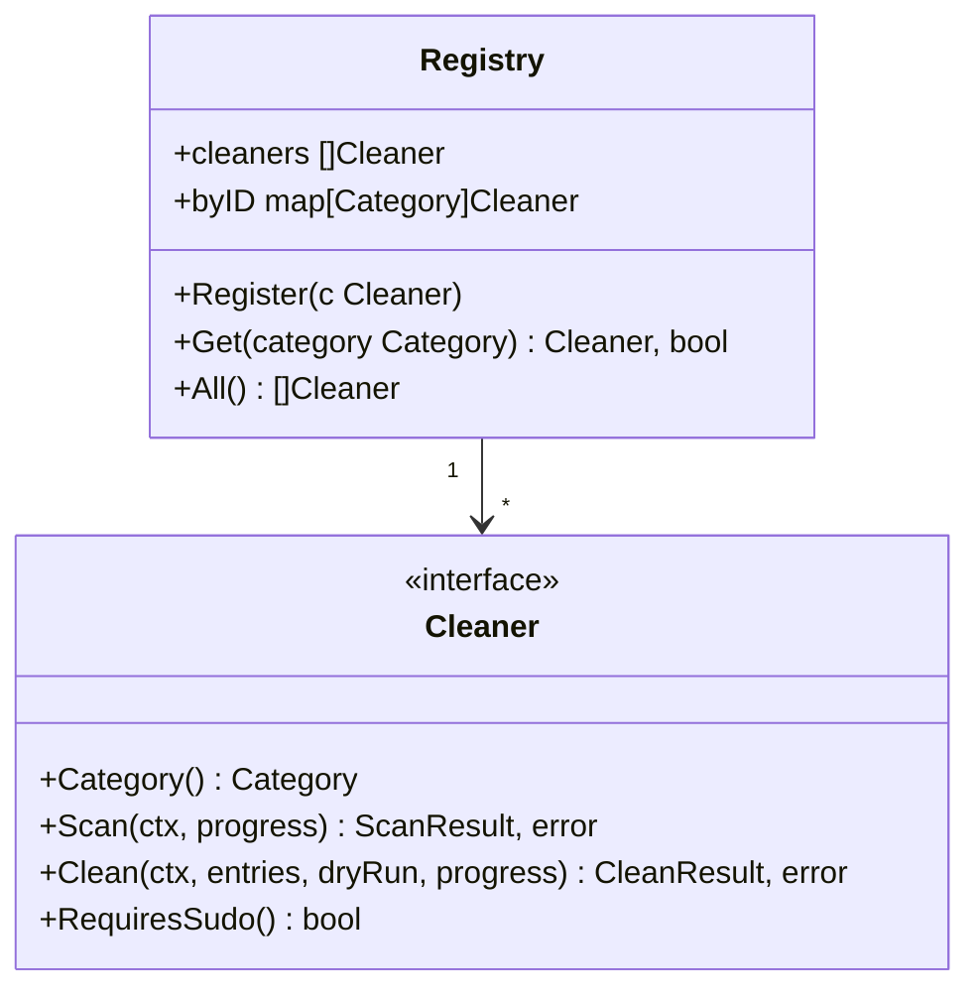
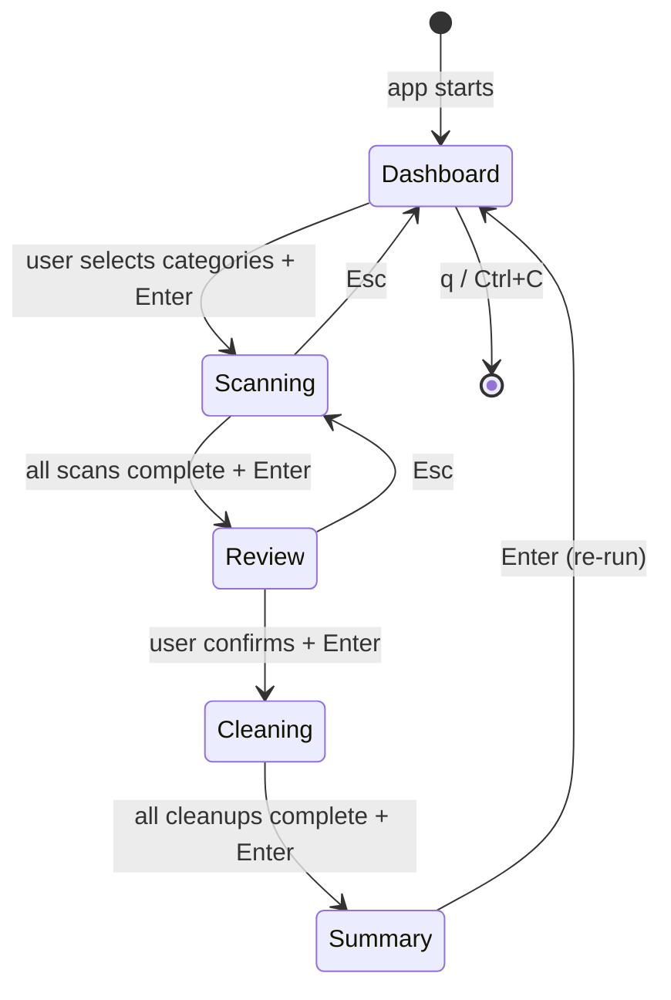
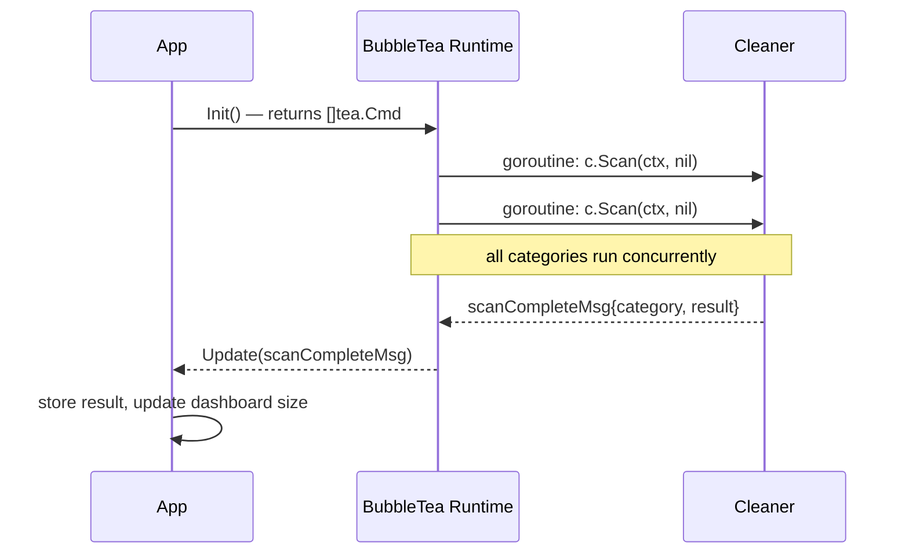
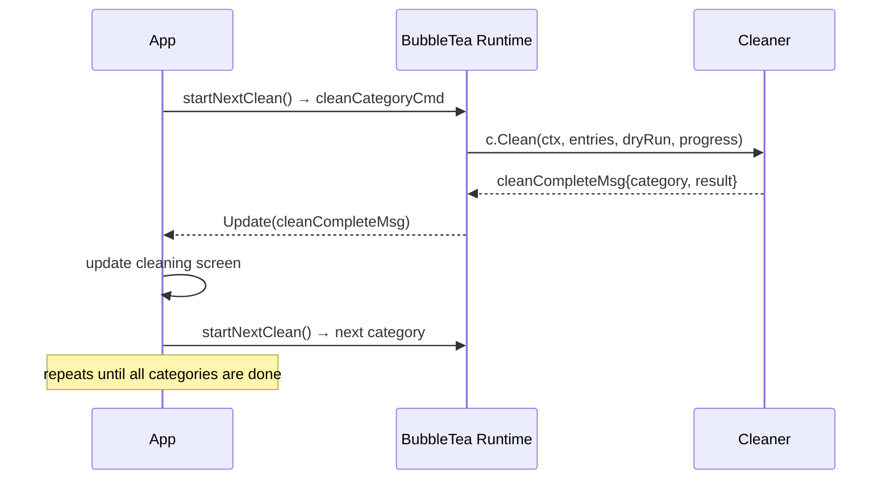
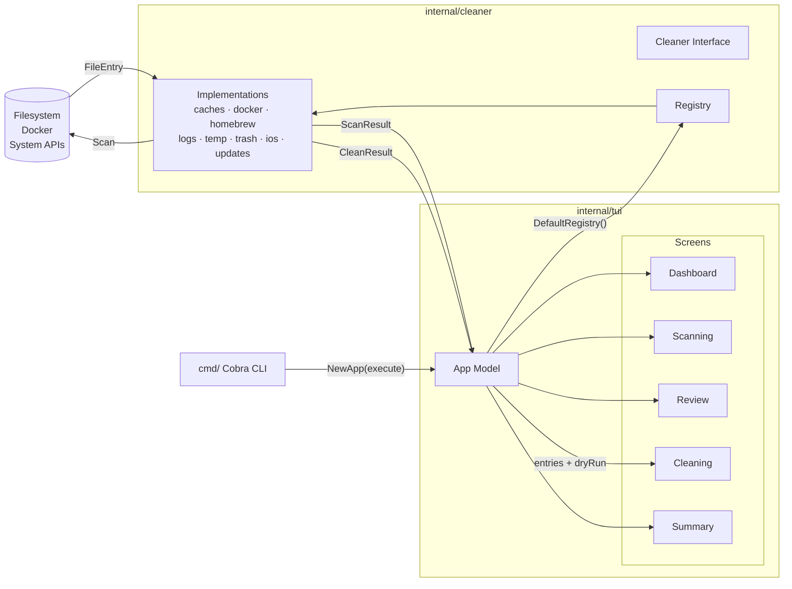
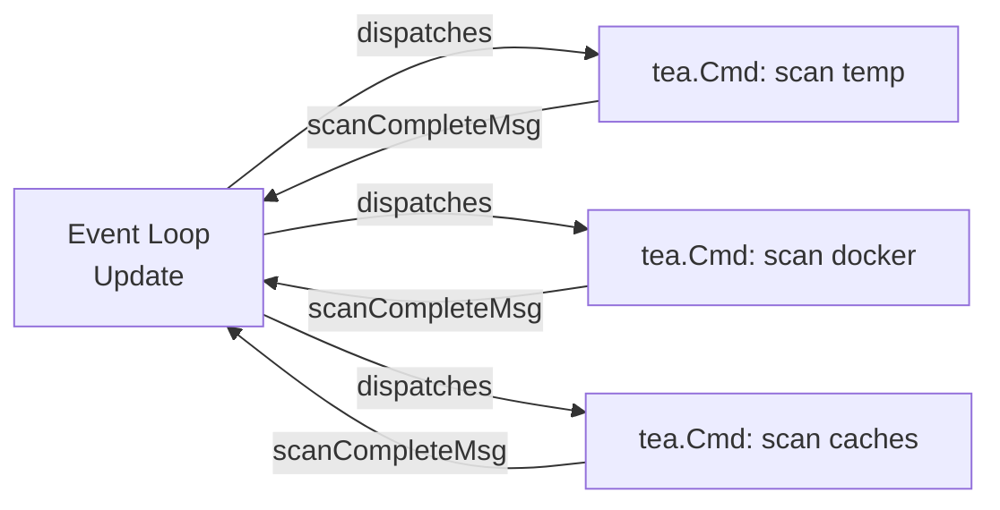
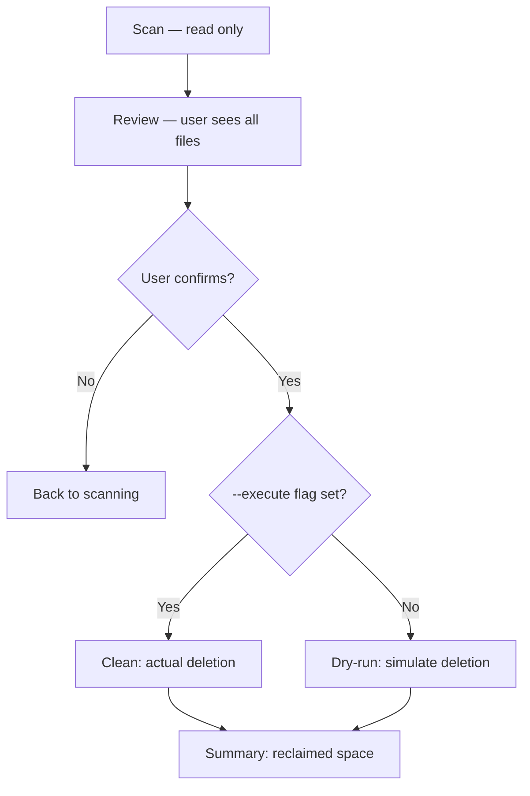

# TidyMyMac — Architecture

> An open-source macOS storage cleanup utility for developers.

This document describes the internal architecture of TidyMyMac: how the packages are organized, how data flows through the system, and the design decisions behind the key abstractions.

---

## Table of Contents

- [High-Level Overview](#high-level-overview)
- [Directory Structure](#directory-structure)
- [Core Abstractions](#core-abstractions)
  - [The Cleaner Interface](#the-cleaner-interface)
  - [The Registry](#the-registry)
  - [Results and Progress Types](#results-and-progress-types)
- [Package Breakdown](#package-breakdown)
  - [cmd/](#cmd)
  - [internal/cleaner/](#internalcleaner)
  - [internal/tui/](#internaltui)
  - [pkg/utils/](#pkgutils)
- [TUI Flow](#tui-flow)
  - [Screen State Machine](#screen-state-machine)
  - [Scan Lifecycle](#scan-lifecycle)
  - [Clean Lifecycle](#clean-lifecycle)
- [Data Flow Diagram](#data-flow-diagram)
- [Concurrency Model](#concurrency-model)
- [Safety Model](#safety-model)
- [Extending TidyMyMac](#extending-tidymymac)

---

## High-Level Overview

TidyMyMac is structured in three main layers:



The **CLI layer** (`cmd/`) parses arguments and either launches the interactive TUI or runs a non-interactive command (like `scan`, `clean`, `history`). The **cleaner layer** (`internal/cleaner/`) is the core domain: it defines a common `Cleaner` interface and holds all individual implementations. The **TUI layer** (`internal/tui/`) drives the interactive experience, delegating all actual work back to the cleaner layer.

---

## Directory Structure

```
tidymymac/
├── cmd/                    # CLI entry points (cobra commands)
│   ├── tidymymac/          # main package — program entry point
│   ├── root.go             # root command, launches TUI
│   ├── scan.go             # `tidymymac scan`
│   ├── clean.go            # `tidymymac clean`
│   ├── explain.go          # `tidymymac explain`
│   └── history.go          # `tidymymac history`
│
├── internal/
│   ├── cleaner/            # core domain: interface, registry, implementations
│   │   ├── registry.go     # Cleaner interface + Registry struct
│   │   ├── category.go     # Category type and display names
│   │   ├── results.go      # FileEntry, ScanResult, CleanResult, progress types
│   │   ├── caches.go       # Application Caches cleaner
│   │   ├── docker.go       # Docker artifacts cleaner
│   │   ├── homebrew.go     # Homebrew cache cleaner
│   │   ├── ios_backups.go  # iOS Backups cleaner
│   │   ├── logs.go         # System Logs cleaner
│   │   ├── temp.go         # Temporary Files cleaner
│   │   ├── trash.go        # Trash cleaner
│   │   ├── updates.go      # macOS Software Updates cleaner
│   │   └── utils.go        # Shared helpers (walk, size calculation, etc.)
│   │
│   ├── tui/                # BubbleTea TUI application
│   │   ├── app.go          # Root model — manages screen transitions
│   │   ├── keys.go         # Keyboard bindings
│   │   ├── styles.go       # Lipgloss styles, logo, tagline
│   │   └── screens/        # Individual screen models
│   │       ├── dashboard.go
│   │       ├── scanning.go
│   │       ├── review.go
│   │       ├── cleaning.go
│   │       └── summary.go
│   │
│   └── scriptgen/          # (planned) Shell script generation feature
│
├── pkg/
│   └── utils/
│       ├── disk.go         # Disk usage helpers
│       └── format.go       # Human-readable size formatting
│
├── docs/                   # Documentation and images
├── bin/                    # Compiled binary (gitignored)
├── Makefile
└── go.mod
```

---

## Core Abstractions

### The Cleaner Interface

Every cleanup category is modeled as a `Cleaner`. The interface lives in `internal/cleaner/registry.go` and is the central contract of the entire system:

```go
type Cleaner interface {
    Category()     Category
    Name()         string
    Description()  string
    Scan(ctx context.Context, progress func(ScanProgress)) (*ScanResult, error)
    Clean(ctx context.Context, entries []FileEntry, dryRun bool, progress func(CleanProgress)) (*CleanResult, error)
    RequiresSudo() bool
}
```

The separation between `Scan` and `Clean` is intentional and enforces the core safety guarantee: **nothing is ever deleted as a side effect of scanning**. A scan produces a `ScanResult` with candidate `FileEntry` items; deletion only happens when `Clean` is explicitly called with those entries.

### The Registry

The `Registry` struct is a simple in-memory store that maps a `Category` to a `Cleaner` implementation:



`DefaultRegistry()` wires up all built-in cleaners:

```go
func DefaultRegistry() *Registry {
    r := NewRegistry()
    r.Register(NewTempCleaner())
    r.Register(NewHomebrewCleaner())
    r.Register(NewCachesCleaner())
    r.Register(NewLogsCleaner())
    r.Register(NewDockerCleaner())
    r.Register(NewIOSBackupsCleaner())
    r.Register(NewUpdatesCleaner())
    r.Register(NewTrashCleaner())
    return r
}
```

This makes it trivial to add new cleaners without touching any existing code — just implement the interface and register it.

### Results and Progress Types

All data flowing between the cleaner layer and the TUI is typed explicitly in `results.go`:

| Type | Purpose |
|---|---|
| `FileEntry` | A single file or directory found during a scan |
| `ScanResult` | Aggregate result of a full category scan |
| `ScanProgress` | Streamed progress update during scanning |
| `CleanResult` | Aggregate result of a cleanup operation |
| `CleanProgress` | Streamed progress update during cleaning |

Progress callbacks (`func(ScanProgress)` and `func(CleanProgress)`) allow cleaners to stream partial results back to the TUI in real time, without coupling the cleaner layer to the UI.

---

## Package Breakdown

### `cmd/`

The `cmd/` package uses [Cobra](https://github.com/spf13/cobra) to define the CLI structure. The root command (`tidymymac`) launches the TUI. Subcommands (`scan`, `clean`, `explain`, `history`) provide non-interactive alternatives.

The `--execute` flag is defined at the root level as a persistent flag, making it available to both the root command and any subcommand that performs deletions:

```go
rootCmd.PersistentFlags().BoolVarP(&executeFlag, "execute", "e", false,
    "Actually delete files (default is dry-run)")
```

### `internal/cleaner/`

This is the heart of the project. Each file in this package implements the `Cleaner` interface for a specific category. Implementations are self-contained: they know which paths to scan, how to calculate sizes, and how to safely delete their targets.

Shared filesystem utilities (directory walking, size aggregation) live in `utils.go` and are used internally across implementations.

### `internal/tui/`

The TUI is built on [BubbleTea](https://github.com/charmbracelet/bubbletea), which follows the Elm architecture: **Model → Update → View**.

The root model is `App` in `app.go`. It holds the current screen state, all screen sub-models, and the cleaner registry. Screen transitions happen inside the `Update` method based on keyboard messages and async results.

Individual screens (`screens/`) are separate structs that expose a `View()` string and handler methods, but they do **not** implement `tea.Model` themselves — `App` owns the entire update loop and delegates to the appropriate screen based on `currentScreen`.

### `pkg/utils/`

Public utilities that could potentially be reused outside the `internal/` boundary. Currently contains disk usage helpers and human-readable byte formatting.

---

## TUI Flow

### Screen State Machine



### Scan Lifecycle

When the app starts, `Init()` immediately fires a `tea.Cmd` for each registered cleaner to run in a goroutine. This means all categories are scanned **in parallel** from the very first frame. Results come back as `scanCompleteMsg` values that the `Update` loop processes one at a time:



If the user navigates to the Scanning screen and a result is already cached from the background scan, it's reused immediately — no duplicate work.

### Clean Lifecycle

Unlike scanning, cleanup is **sequential** — one category at a time. This is a deliberate design choice to avoid interleaved filesystem operations and make progress reporting straightforward. After each category finishes, `handleCleanComplete` calls `startNextClean()` to fire the next one:



---

## Data Flow Diagram

End-to-end data flow from filesystem to screen:



---

## Concurrency Model

TidyMyMac relies entirely on BubbleTea's concurrency model. There are **no manually managed goroutines or channels** in application code.

`tea.Cmd` is a `func() tea.Msg` — BubbleTea runs it in a goroutine and delivers the result as a message to `Update`. This means:

- All scans run concurrently as separate `tea.Cmd` goroutines
- The UI never blocks — the event loop always remains responsive
- Cancellation is handled via a `context.Context` stored in `App`, with `cancel()` called on quit



---

## Safety Model

The entire system is designed around a single invariant: **files are never touched without explicit user confirmation**.

This is enforced at multiple levels:

1. **Interface contract**: `Scan` and `Clean` are separate methods. Scanning never has side effects.
2. **Dry-run by default**: The `dryRun` flag is `true` unless the user passes `--execute`. Cleaners receive this flag and must respect it.
3. **Confirmed entries only**: `Clean` receives only the `[]FileEntry` that the user explicitly reviewed and confirmed in the Review screen — not the full scan result.
4. **Context cancellation**: If the user quits mid-operation, `cancel()` is called, and cleaners are expected to respect `ctx.Done()`.



---

## Extending TidyMyMac

Adding a new cleanup category requires three steps:

**1. Implement the `Cleaner` interface**

```go
// internal/cleaner/xcode.go

type XcodeCleaner struct{}

func NewXcodeCleaner() *XcodeCleaner { return &XcodeCleaner{} }

func (x *XcodeCleaner) Category()    cleaner.Category { return CategoryXcode }
func (x *XcodeCleaner) Name()        string           { return "Xcode Derived Data" }
func (x *XcodeCleaner) Description() string           { return "Removes Xcode build artifacts from DerivedData" }
func (x *XcodeCleaner) RequiresSudo() bool            { return false }

func (x *XcodeCleaner) Scan(ctx context.Context, progress func(ScanProgress)) (*ScanResult, error) {
    // walk ~/Library/Developer/Xcode/DerivedData
}

func (x *XcodeCleaner) Clean(ctx context.Context, entries []FileEntry, dryRun bool, progress func(CleanProgress)) (*CleanResult, error) {
    // delete entries, respect dryRun
}
```

**2. Add the category constant**

```go
// internal/cleaner/category.go
const CategoryXcode Category = "xcode"
```

**3. Register it in `DefaultRegistry()`**

```go
r.Register(NewXcodeCleaner())
```

The TUI, dashboard, scanning screen, and review screen will all pick it up automatically — no changes required elsewhere.
