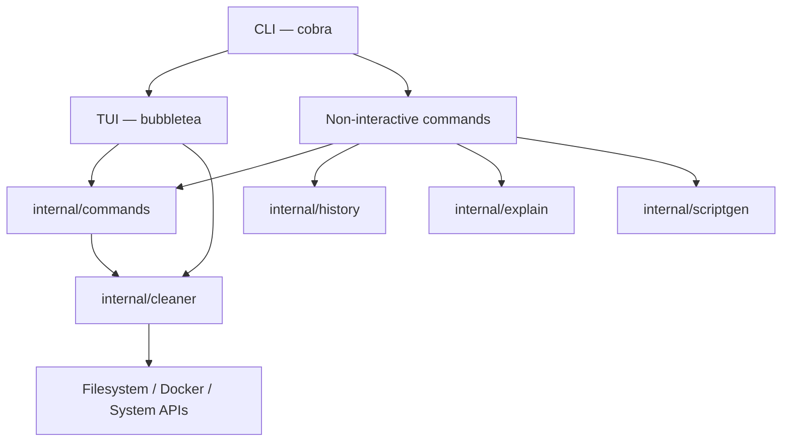
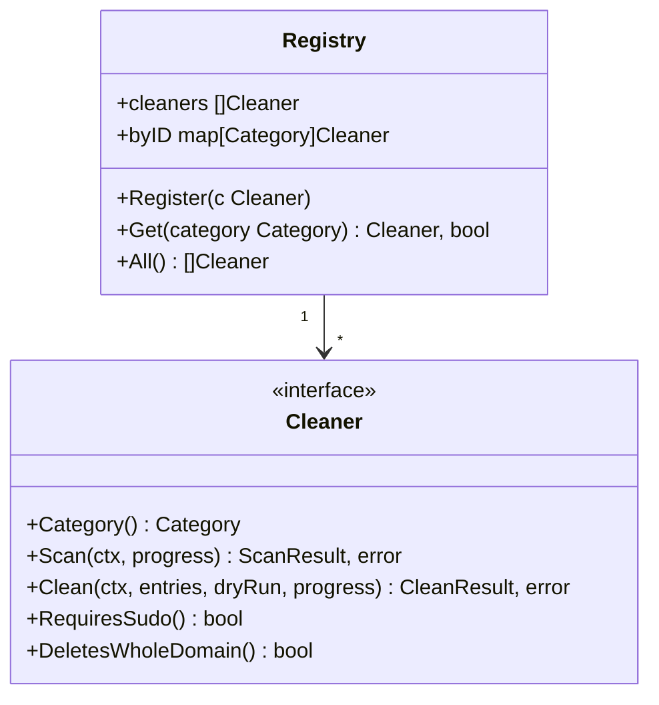
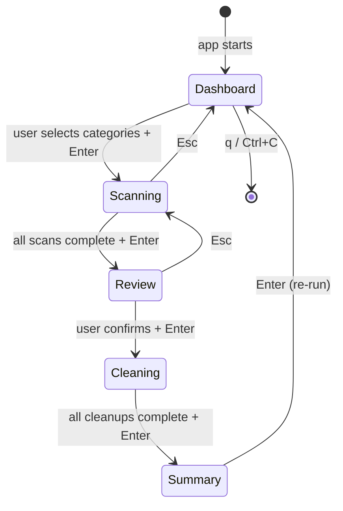
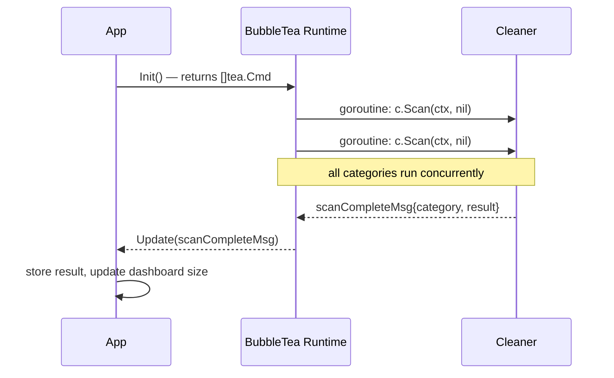
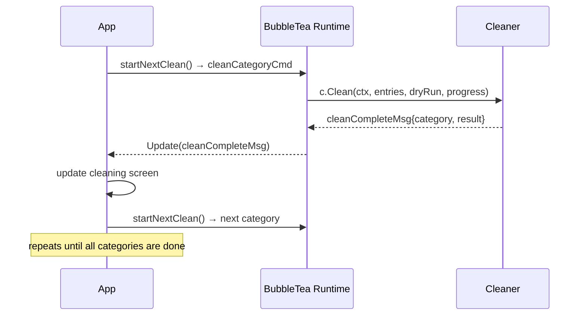
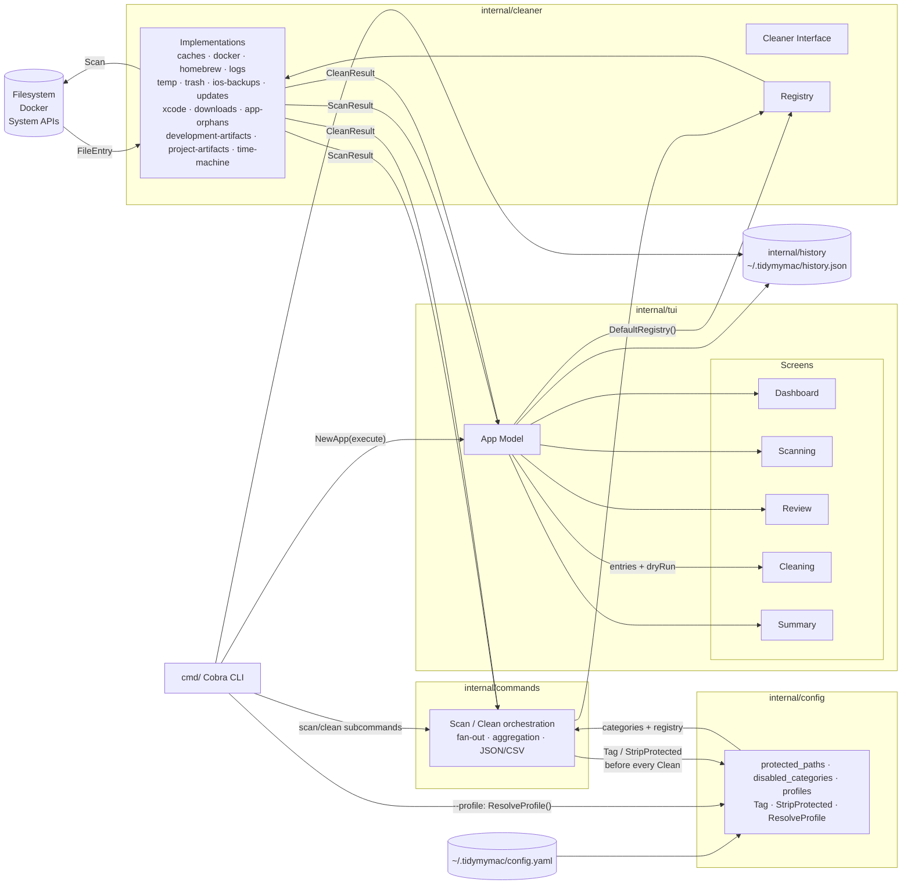
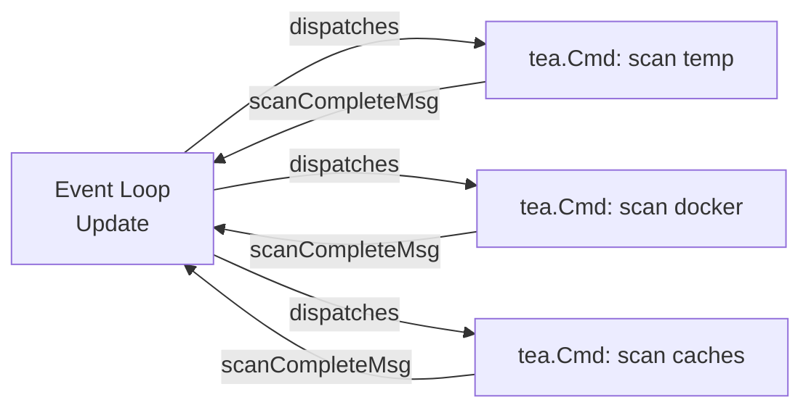
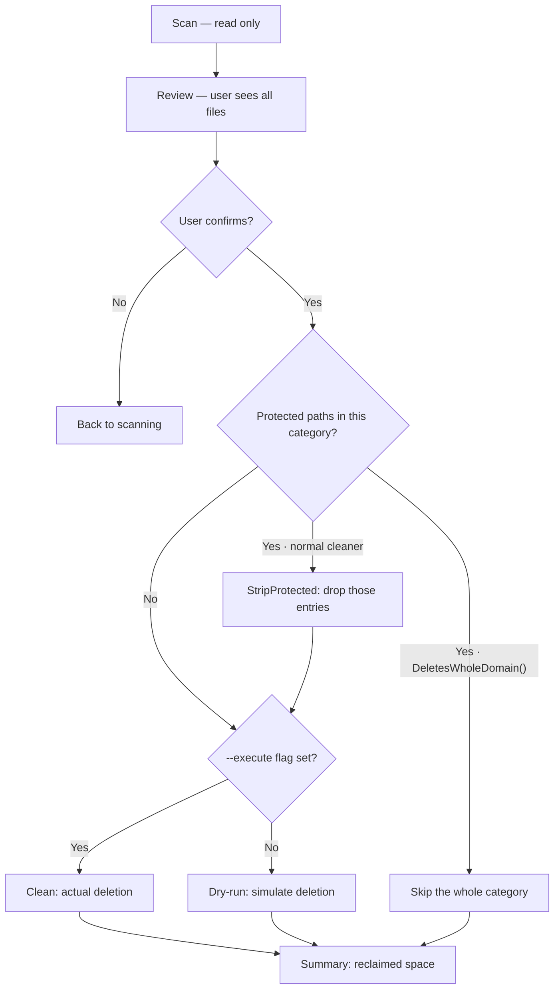

# TidyMyMac — Architecture

> An open-source macOS storage cleanup utility for developers.

This document describes the internal architecture of TidyMyMac: how the packages are organized, how data flows through the system, and the design decisions behind the key abstractions.

---

## Table of Contents

- [High-Level Overview](#high-level-overview)
- [Directory Structure](#directory-structure)
- [Core Abstractions](#core-abstractions)
  - [The Cleaner Interface](#the-cleaner-interface)
  - [The Registry](#the-registry)
  - [Results and Progress Types](#results-and-progress-types)
- [Package Breakdown](#package-breakdown)
  - [cmd/](#cmd)
  - [internal/cleaner/](#internalcleaner)
  - [internal/commands/](#internalcommands)
  - [internal/config/](#internalconfig)
  - [internal/tui/](#internaltui)
  - [internal/history/](#internalhistory)
  - [internal/explain/](#internalexplain)
  - [internal/scriptgen/](#internalscriptgen)
  - [internal/buildinfo/](#internalbuildinfo)
  - [pkg/utils/](#pkgutils)
- [TUI Flow](#tui-flow)
  - [Screen State Machine](#screen-state-machine)
  - [Scan Lifecycle](#scan-lifecycle)
  - [Clean Lifecycle](#clean-lifecycle)
- [Data Flow Diagram](#data-flow-diagram)
- [Concurrency Model](#concurrency-model)
- [Safety Model](#safety-model)
- [Extending TidyMyMac](#extending-tidymymac)

---

## High-Level Overview

TidyMyMac is structured in three main layers:


```mermaid
graph TD
    A[CLI — cobra] --> B[TUI — bubbletea]
    A --> C[Non-interactive commands]
    B --> CMD[internal/commands]
    C --> CMD
    CMD --> D[internal/cleaner]
    B --> D
    D --> E[Filesystem / Docker / System APIs]
    C --> H[internal/history]
    C --> EXP[internal/explain]
    C --> SG[internal/scriptgen]
```

The **CLI layer** (`cmd/`) parses arguments and either launches the interactive TUI or runs a non-interactive command (like `scan`, `clean`, `list`, `stats`, `explain`, `history`, `version`). The **cleaner layer** (`internal/cleaner/`) is the core domain: it defines a common `Cleaner` interface and holds all individual implementations. The **commands layer** (`internal/commands/`) wraps the cleaner layer with reusable scan/clean orchestration (fan-out, aggregation, JSON/CSV shaping) that both the CLI subcommands and the TUI consume. The **TUI layer** (`internal/tui/`) drives the interactive experience, delegating all actual work back to the cleaner and commands layers.

---

## Directory Structure

```
tidymymac/
├── cmd/                          # CLI entry points (cobra commands)
│   ├── tidymymac/                # main package — program entry point
│   ├── root.go                   # root command, launches TUI, loads config
│   ├── scan.go                   # `tidymymac scan`
│   ├── clean.go                  # `tidymymac clean`
│   ├── list.go                   # `tidymymac list categories|protected|profiles`
│   ├── profile.go                # `tidymymac profile <subcommand>`
│   ├── protect.go                # `tidymymac protect --path`
│   ├── unprotect.go              # `tidymymac unprotect --path`
│   ├── stats.go                  # `tidymymac stats [category]`
│   ├── explain.go                # `tidymymac explain <topic>`
│   ├── history.go                # `tidymymac history`
│   └── version.go                # `tidymymac version`
│
├── internal/
│   ├── cleaner/                  # core domain: interface, registry, implementations
│   │   ├── registry.go           # Cleaner interface + Registry struct
│   │   ├── category.go           # Category type and display names
│   │   ├── results.go            # FileEntry, ScanResult, CleanResult, progress types
│   │   ├── app_orphans.go        # Leftovers from uninstalled apps cleaner
│   │   ├── caches.go             # Application Caches cleaner
│   │   ├── development_artifacts.go # Go build/mod cache cleaner
│   │   ├── docker.go             # Docker artifacts cleaner
│   │   ├── downloads.go          # Installers and large items in ~/Downloads cleaner
│   │   ├── homebrew.go           # Homebrew cache cleaner
│   │   ├── ios_backups.go        # iOS Backups cleaner
│   │   ├── logs.go               # System Logs cleaner
│   │   ├── project_artifacts.go  # Junk dirs/large files in profile-configured project paths
│   │   ├── temp.go               # Temporary Files cleaner
│   │   ├── time_machine.go       # Time Machine local snapshots cleaner
│   │   ├── trash.go              # Trash cleaner
│   │   ├── updates.go            # macOS Software Updates cleaner
│   │   ├── xcode.go              # Xcode DerivedData/archives/simulators cleaner
│   │   └── utils.go              # Shared helpers (walk, size calculation, etc.)
│   │
│   ├── commands/                 # Reusable scan/clean orchestration shared by CLI and TUI
│   │   ├── scan.go               # Parallel fan-out scan + JSON/CSV rendering
│   │   ├── scan_input.go         # Category argument parsing/validation
│   │   └── clean.go              # Sequential clean orchestration + result aggregation
│   │
│   ├── config/                   # Safety config at ~/.tidymymac/config.yaml
│   │   ├── config.go             # Load/normalize, protected-path matching, ResolveProfile
│   │   ├── write.go              # yaml.Node surgery for protected_paths + atomic write
│   │   └── write_profiles.go     # Same, for the profiles tree
│   │
│   ├── tui/                      # BubbleTea TUI application
│   │   ├── app.go                # Root model — manages screen transitions
│   │   ├── keys.go               # Keyboard bindings
│   │   ├── styles/               # Lipgloss styles, logo, tagline
│   │   └── screens/              # Individual screen models
│   │       ├── dashboard.go
│   │       ├── scanning.go
│   │       ├── review.go
│   │       ├── cleaning.go
│   │       └── summary.go
│   │
│   ├── history/                  # Cleanup run history persisted at ~/.tidymymac/history.json
│   │   ├── history.go            # Load/append/Stats/StatsByCategory
│   │   └── utils.go              # File I/O helpers
│   │
│   ├── explain/                  # `explain` command: composes contributor data into storage topics
│   │   ├── topic.go              # Topic type (e.g. system-data)
│   │   ├── registry.go           # Topic registry + ResolveTopic
│   │   ├── contributors.go       # Per-category contributors (how each category feeds a topic)
│   │   ├── wrapper.go            # Runs the topic and formats the result
│   │   └── utils.go
│   │
│   ├── scriptgen/                # Shell cleanup script generation from scan results
│   │   └── scriptgen.go
│   │
│   └── buildinfo/                # Version/commit/date ldflag variables for `version` command
│       └── buildinfo.go
│
├── pkg/
│   └── utils/
│       ├── disk.go               # Disk usage helpers
│       └── format.go             # Human-readable size formatting
│
├── docs/                         # Documentation and images
├── bin/                          # Compiled binary (gitignored)
├── Makefile
└── go.mod
```

---

## Core Abstractions

### The Cleaner Interface

Every cleanup category is modeled as a `Cleaner`. The interface lives in `internal/cleaner/registry.go` and is the central contract of the entire system:

```go
type Cleaner interface {
    Category()     Category
    Name()         string
    Description()  string
    Scan(ctx context.Context, progress func(ScanProgress)) (*ScanResult, error)
    Clean(ctx context.Context, entries []FileEntry, dryRun bool, progress func(CleanProgress)) (*CleanResult, error)
    RequiresSudo() bool
    DeletesWholeDomain() bool
}
```

The separation between `Scan` and `Clean` is intentional and enforces the core safety guarantee: **nothing is ever deleted as a side effect of scanning**. A scan produces a `ScanResult` with candidate `FileEntry` items; deletion only happens when `Clean` is explicitly called with those entries.

`DeletesWholeDomain()` is the escape hatch for cleaners that cannot honor a filtered entry list. Homebrew, Development Artifacts and Trash shell out to a command (`brew cleanup`, `go clean -cache -modcache`, Finder's "empty trash") that clears their entire domain regardless of what they were handed. Callers must never invoke `Clean` on such a cleaner when any entry was withheld — see [Safety Model](#safety-model).

### The Registry

The `Registry` struct is a simple in-memory store that maps a `Category` to a `Cleaner` implementation:


```mermaid
classDiagram
    class Registry {
        +cleaners []Cleaner
        +byID map[Category]Cleaner
        +Register(c Cleaner)
        +Get(category Category) Cleaner, bool
        +All() []Cleaner
    }

    class Cleaner {
        <<interface>>
        +Category() Category
        +Scan(ctx, progress) ScanResult, error
        +Clean(ctx, entries, dryRun, progress) CleanResult, error
        +RequiresSudo() bool
        +DeletesWholeDomain() bool
    }

    Registry "1" --> "*" Cleaner
```

`DefaultRegistry()` wires up all built-in cleaners:

```go
func DefaultRegistry() *Registry {
    r := NewRegistry()
    r.Register(NewTempCleaner())
    r.Register(NewHomebrewCleaner())
    r.Register(NewCachesCleaner())
    r.Register(NewDevelopmentArtifactsCleaner())
    r.Register(NewProjectArtifactsCleaner(nil, 0, false))
    r.Register(NewLogsCleaner())
    r.Register(NewDockerCleaner())
    r.Register(NewIOSBackupsCleaner())
    r.Register(NewUpdatesCleaner())
    r.Register(NewDownloadsCleaner())
    r.Register(NewAppOrphansCleaner())
    r.Register(NewTrashCleaner())
    r.Register(NewXcodeCleaner())
    r.Register(NewTimeMachineCleaner())
    return r
}
```

`NewProjectArtifactsCleaner` is the one cleaner registered with no targets: its project roots come from a profile, so the default instance scans nothing until `config.ResolveProfile` substitutes a configured one (see [internal/config/](#internalconfig)).

The built-in categories (see `internal/cleaner/category.go`) are:

| Category constant | ID string | Display name |
|---|---|---|
| `CategoryTemp` | `temp` | Temporary Files |
| `CategoryHomebrew` | `homebrew` | Homebrew Cache |
| `CategoryApplicationCaches` | `app-caches` | Application Caches |
| `CategoryDevelopmentArtifacts` | `development-artifacts` | Development Artifacts |
| `CategoryProjectArtifacts` | `project-artifacts` | Project Artifacts |
| `CategoryLogs` | `logs` | System Logs |
| `CategoryDocker` | `docker` | Docker |
| `CategoryIOSBackups` | `ios-backups` | iOS Backups |
| `CategoryUpdates` | `macos-updates` | macOS Updates |
| `CategoryDownloads` | `downloads` | Downloads |
| `CategoryAppOrphans` | `app-orphans` | App Orphans |
| `CategoryTrashBin` | `trash` | Trash Files |
| `CategoryXcode` | `xcode` | Xcode |
| `CategoryTimeMachineSnapshots` | `time-machine` | Time Machine Snapshots |

Adding a new cleaner is purely additive — implement the interface, add a category constant, and register it (see [Extending TidyMyMac](#extending-tidymymac)).

### Results and Progress Types

All data flowing between the cleaner layer and the TUI is typed explicitly in `results.go`:

| Type | Purpose |
|---|---|
| `FileEntry` | A single file or directory found during a scan |
| `ScanResult` | Aggregate result of a full category scan |
| `ScanProgress` | Streamed progress update during scanning |
| `CleanResult` | Aggregate result of a cleanup operation |
| `CleanProgress` | Streamed progress update during cleaning |

`FileEntry` carries one field no `Scan` implementation may ever set: `Protected`. It is written exclusively by `internal/config`'s tagging layer, immediately before a clean, and is what `StripProtected` filters on.

Progress callbacks (`func(ScanProgress)` and `func(CleanProgress)`) allow cleaners to stream partial results back to the TUI in real time, without coupling the cleaner layer to the UI.

---

## Package Breakdown

### `cmd/`

The `cmd/` package uses [Cobra](https://github.com/spf13/cobra) to define the CLI structure. The root command (`tidymymac`) launches the TUI. Subcommands provide non-interactive alternatives:

| Command | Purpose |
|---|---|
| `scan [categories...]` | Run scans and emit an interactive table or machine-readable JSON/CSV (with `--output`, `--detailed`, `--save`, `--quiet`, `--generate-script`). `--profile <name>` runs a configured profile instead of positional categories. |
| `clean [categories...]` | Delete scanned files. Dry-run by default; destructive only with `--execute`. Supports `--from-file` to reuse a previously saved detailed scan, `--output json`, `--profile <name>`, and `--include-large-files` to opt into deleting the oversized files a profile's project paths turn up. |
| `list categories\|protected\|profiles` | Print all registered categories (add `--detailed` for descriptions), the current safety config, or the configured profiles. |
| `profile <subcommand>` | `create`, `delete`, `add-category`, `remove-category`, `add-path`, `remove-path` — CRUD over the `profiles` tree in the config file. |
| `protect --path` / `unprotect --path` | Add or remove an entry in `protected_paths`. |
| `stats [category]` | Aggregate all-time statistics from the local history store. |
| `explain <topic>` | Explain a macOS storage topic (e.g. `system-data`) by composing contributor data from multiple cleaners. |
| `history` | Show past cleanup runs. |
| `version` | Print version, commit, build date, platform, and Go version (values come from `internal/buildinfo`). |

The root command's `PersistentPreRunE` loads `internal/config` once for **every** subcommand and stores it in `loadedConfig`, so no subcommand can accidentally run with protection disabled. A malformed config aborts the command rather than falling back to an empty one.

The `--execute` flag is defined at the root level as a persistent flag, making it available to both the root command and any subcommand that performs deletions:

```go
rootCmd.PersistentFlags().BoolVarP(&executeFlag, "execute", "e", false,
    "execute deletions; without this flag runs as a dry-run preview")
```

### `internal/cleaner/`

This is the heart of the project. Each file in this package implements the `Cleaner` interface for a specific category. Implementations are self-contained: they know which paths to scan, how to calculate sizes, and how to safely delete their targets.

Shared filesystem utilities (directory walking, size aggregation) live in `utils.go` and are used internally across implementations. Cleaners that shell out to external tools (e.g. `docker` for `docker.go`, `tmutil` for `time_machine.go`) gracefully degrade to an empty scan result when the tool is absent, so the TUI and the non-interactive commands remain usable on any Mac.

### `internal/commands/`

This package contains the reusable orchestration logic that both the Cobra subcommands and (increasingly) the TUI depend on. It exists so that the same behavior — argument parsing, category filtering, parallel scan fan-out, JSON/CSV shaping, sequential clean execution, error aggregation — is implemented exactly once.

- `scan.go` — runs `Scan` across the registry concurrently using a `sync.WaitGroup`, then produces a `ScanCategoryResult` per category. Supports `Detailed` mode (which includes the full `[]FileEntry` list) and JSON/CSV writers.
- `scan_input.go` — normalizes user-provided category arguments against the registry and returns a filtered subset (or a helpful error listing valid categories).
- `clean.go` — runs `Clean` sequentially, aggregating per-category results into a single `CleanResult` structure suitable for the CLI or TUI summary.

Note that this package has **no profile-specific code**. It already accepts an arbitrary `*cleaner.Registry` plus a `[]string` of selected categories, which is exactly what `config.ResolveProfile` returns — so `--profile` is resolved in the `cmd/` layer and flows through the existing pipeline unchanged.

### `internal/config/`

The safety layer, backed by `~/.tidymymac/config.yaml` (see [docs/CONFIGURATION.md](CONFIGURATION.md) for the user-facing format). It owns three independent settings — `protected_paths`, `disabled_categories` and `profiles` — and the code that enforces them.

**Loading.** `Load()` decodes with `KnownFields(true)`, so an unrecognized key is a hard error rather than a silent zero-value config: running as if `protected_paths` were empty while the user believes it is active is the worst failure mode this package can have. A missing or empty file is *not* an error. `normalize()` pre-computes the comparison form of every protected path (tilde-expanded, cleaned, case-folded, plus macOS firmlink aliases and resolved symlinks). It deliberately does **not** validate profiles: a broken profile is not a safety risk until it is used, and failing `Load` would block every command, including ones that never touch profiles.

**Enforcement.** These functions are what the clean pipeline calls, in this order:

| Function | Role |
|---|---|
| `IsProtected(path)` | Path is a protected root, or nested under one. |
| `ContainsProtected(path)` | A protected root is nested *inside* path — the reverse check, for directory entries recorded as whole units. |
| `Tag(entries)` | Marks `FileEntry.Protected` where either check matches (containment only applies to `IsDir` entries). Never removes anything: scans and dry-runs must still show protected files. |
| `CountProtected(entries)` | Used to decide whether a `DeletesWholeDomain()` cleaner must be skipped entirely. |
| `StripProtected(entries)` | The hard block — drops tagged entries immediately before `Clean` and before any generated script. |
| `FilterRegistry(r, cfg)` | Applies `disabled_categories`, but only where there is no explicit user selection to take precedence. |

**Profile resolution.** `ResolveProfile(base, name, includeLargeFiles)` returns the `(categories, registry)` pair described above. When a profile has project paths, it rebuilds the registry from `base.All()` with a configured `ProjectArtifactsCleaner` substituted in place — rebuilt rather than re-`Register`ed, because `Register` replaces the `byID` entry but *appends* to the ordered slice, which would leave `All()` returning the cleaner twice. Profile paths are re-validated here, so a hand-edited entry fails only that profile.

**Writing.** `write.go` and `write_profiles.go` edit the file as a `yaml.Node` tree rather than re-marshalling a struct, which is what preserves hand-written comments. Every write is atomic (temp file + rename, mirroring `internal/history`) and is followed by a reload that must still satisfy `Load`'s invariants — catching a node-surgery bug at `protect`/`profile` time instead of on the next real clean. An already-invalid file is refused rather than patched around.

### `internal/tui/`

The TUI is built on [BubbleTea](https://github.com/charmbracelet/bubbletea), which follows the Elm architecture: **Model → Update → View**.

The root model is `App` in `app.go`. It holds the current screen state, all screen sub-models, and the cleaner registry. Screen transitions happen inside the `Update` method based on keyboard messages and async results.

Individual screens (`screens/`) are separate structs that expose a `View()` string and handler methods, but they do **not** implement `tea.Model` themselves — `App` owns the entire update loop and delegates to the appropriate screen based on `currentScreen`. Lipgloss styles, the logo and the tagline live in `internal/tui/styles/` so they can be reused by both the TUI and the CLI output (e.g. `list categories`, `stats`).

### `internal/history/`

`history` owns the persistent cleanup-run record stored at `~/.tidymymac/history.json`. It exposes:

- `Load()` — read or create the history file.
- `Append(run)` — append a new run after a successful cleanup.
- `Stats(record)` / `StatsByCategory(record, category)` — reduce the record into an `AllTimeStats` structure (total runs, total files, total bytes, average, last run).

The `history` and `stats` CLI commands and the TUI summary screen all consume this package; no other layer reads or writes the history file directly.

### `internal/explain/`

The `explain` command composes read-only information from multiple cleaners into a higher-level **storage topic** (today: `system-data`). Key types:

- `Topic` — a topic identifier plus `DisplayName()`.
- `Registry` / `TopicDefinition` — maps a topic to the contributors that feed into it. `TopicDefinition.Aliases` holds every name the topic answers to; the first is canonical.
- `Contributor` — a per-category adapter that produces narrative data for a topic (e.g. how Xcode and Docker contribute to "System Data").
- `ResolveTopic`, `RunTopic`, `FormatTopicResult` — public entry points used by `cmd/explain.go`.

A *topic* is deliberately distinct from a cleanup *profile* (`internal/config`): a topic is a macOS storage concept the user asks about and cannot configure, while a profile is a user-authored bundle of categories and paths. These were both called "profile" until the rename.

Because contributors are read-only, `explain` never deletes anything and never needs the `--execute` flag.

### `internal/scriptgen/`

`scriptgen` takes a detailed `ScanResult` (or set of results) and produces a self-contained shell script that the user can review and run manually. This powers `scan --generate-script` and lets users decouple reviewing from executing: the script embeds the exact paths found, so there is no re-scan between preview and delete.

### `internal/buildinfo/`

A tiny package holding `Version`, `Commit`, `Date` variables populated at build time via `-ldflags`. `cmd/version.go` reads these to render the output of `tidymymac version`. Isolated into its own package so both the CLI and any tests can access it without pulling in Cobra.

### `pkg/utils/`

Public utilities that could potentially be reused outside the `internal/` boundary. Currently contains disk usage helpers and human-readable byte formatting.

---

## TUI Flow

### Screen State Machine


```mermaid
stateDiagram-v2
    [*] --> Dashboard : app starts
    Dashboard --> Scanning : user selects categories + Enter
    Scanning --> Review : all scans complete + Enter
    Review --> Cleaning : user confirms + Enter
    Cleaning --> Summary : all cleanups complete + Enter
    Summary --> Dashboard : Enter (re-run)

    Dashboard --> [*] : q / Ctrl+C
    Scanning --> Dashboard : Esc
    Review --> Scanning : Esc
```

### Scan Lifecycle

When the app starts, `Init()` immediately fires a `tea.Cmd` for each registered cleaner to run in a goroutine. This means all categories are scanned **in parallel** from the very first frame. Results come back as `scanCompleteMsg` values that the `Update` loop processes one at a time:


```mermaid
sequenceDiagram
    participant App
    participant BubbleTea Runtime
    participant Cleaner

    App->>BubbleTea Runtime: Init() — returns []tea.Cmd
    BubbleTea Runtime->>Cleaner: goroutine: c.Scan(ctx, nil)
    BubbleTea Runtime->>Cleaner: goroutine: c.Scan(ctx, nil)
    Note over BubbleTea Runtime,Cleaner: all categories run concurrently
    Cleaner-->>BubbleTea Runtime: scanCompleteMsg{category, result}
    BubbleTea Runtime-->>App: Update(scanCompleteMsg)
    App->>App: store result, update dashboard size
```

If the user navigates to the Scanning screen and a result is already cached from the background scan, it's reused immediately — no duplicate work.

### Clean Lifecycle

Unlike scanning, cleanup is **sequential** — one category at a time. This is a deliberate design choice to avoid interleaved filesystem operations and make progress reporting straightforward. After each category finishes, `handleCleanComplete` calls `startNextClean()` to fire the next one:


```mermaid
sequenceDiagram
    participant App
    participant BubbleTea Runtime
    participant Cleaner

    App->>BubbleTea Runtime: startNextClean() → cleanCategoryCmd
    BubbleTea Runtime->>Cleaner: c.Clean(ctx, entries, dryRun, progress)
    Cleaner-->>BubbleTea Runtime: cleanCompleteMsg{category, result}
    BubbleTea Runtime-->>App: Update(cleanCompleteMsg)
    App->>App: update cleaning screen
    App->>BubbleTea Runtime: startNextClean() → next category
    Note over App: repeats until all categories are done
```

---

## Data Flow Diagram

End-to-end data flow from filesystem to screen:


```mermaid
flowchart LR
    FS[(Filesystem\nDocker\nSystem APIs)]

    subgraph internal/cleaner
        CI[Cleaner Interface]
        REG[Registry]
        IMPL[Implementations\ncaches · docker · homebrew · logs\ntemp · trash · ios-backups · updates\nxcode · downloads · app-orphans\ndevelopment-artifacts · project-artifacts · time-machine]
    end

    subgraph internal/commands
        CMDS[Scan / Clean orchestration\nfan-out · aggregation · JSON/CSV]
    end

    subgraph internal/config
        CFG[protected_paths · disabled_categories · profiles\nTag · StripProtected · ResolveProfile]
    end

    subgraph internal/tui
        APP[App Model]
        subgraph Screens
            DASH[Dashboard]
            SCAN[Scanning]
            REV[Review]
            CLEAN[Cleaning]
            SUM[Summary]
        end
    end

    CLI[cmd/ Cobra CLI]
    HIST[(internal/history\n~/.tidymymac/history.json)]
    YAML[(~/.tidymymac/config.yaml)]

    YAML --> CFG
    CLI -->|"NewApp(execute)"| APP
    CLI -->|scan/clean subcommands| CMDS
    CLI -->|"--profile: ResolveProfile()"| CFG
    CFG -->|"categories + registry"| CMDS
    CMDS --> REG
    APP -->|"DefaultRegistry()"| REG
    REG --> IMPL
    IMPL -->|Scan| FS
    FS -->|FileEntry| IMPL
    IMPL -->|ScanResult| CMDS
    CMDS -->|"Tag / StripProtected\nbefore every Clean"| CFG
    IMPL -->|ScanResult| APP
    APP --> DASH
    APP --> SCAN
    APP --> REV
    APP -->|"entries + dryRun"| CLEAN
    IMPL -->|CleanResult| APP
    IMPL -->|CleanResult| CMDS
    APP --> SUM
    APP --> HIST
    CLI --> HIST
```

---

## Concurrency Model

TidyMyMac relies entirely on BubbleTea's concurrency model. There are **no manually managed goroutines or channels** in application code.

`tea.Cmd` is a `func() tea.Msg` — BubbleTea runs it in a goroutine and delivers the result as a message to `Update`. This means:

- All scans run concurrently as separate `tea.Cmd` goroutines
- The UI never blocks — the event loop always remains responsive
- Cancellation is handled via a `context.Context` stored in `App`, with `cancel()` called on quit


```mermaid
graph LR
    EC[Event Loop\nUpdate] -->|dispatches| CMD1[tea.Cmd: scan temp]
    EC -->|dispatches| CMD2[tea.Cmd: scan docker]
    EC -->|dispatches| CMD3[tea.Cmd: scan caches]
    CMD1 -->|scanCompleteMsg| EC
    CMD2 -->|scanCompleteMsg| EC
    CMD3 -->|scanCompleteMsg| EC
```

---

## Safety Model

The entire system is designed around a single invariant: **files are never touched without explicit user confirmation**.

This is enforced at multiple levels:

1. **Interface contract**: `Scan` and `Clean` are separate methods. Scanning never has side effects.
2. **Dry-run by default**: The `dryRun` flag is `true` unless the user passes `--execute`. Cleaners receive this flag and must respect it.
3. **Confirmed entries only**: `Clean` receives only the `[]FileEntry` that the user explicitly reviewed and confirmed in the Review screen — not the full scan result.
4. **Context cancellation**: If the user quits mid-operation, `cancel()` is called, and cleaners are expected to respect `ctx.Done()`.
5. **Protected paths are a hard block**: `config.StripProtected` runs immediately before *every* `Clean` invocation and before any generated deletion script, unconditionally. There is no CLI flag that overrides `protected_paths` — by design. Protection is not filtering: `Tag` only marks entries, so scans and dry-run previews still *show* protected files, they simply are never passed to `Clean`. Containment applies in both directions, so a directory entry that contains a protected path is protected as a whole (deleting it would take the protected path with it).
6. **Whole-domain cleaners skip rather than under-honor**: when a protected path lands in a category whose cleaner reports `DeletesWholeDomain()`, there is no way to run it while sparing that path. The category is skipped entirely, with an error explaining why, instead of running with a silently-filtered list.


```mermaid
flowchart TD
    A[Scan — read only] --> B[Review — user sees all files]
    B --> C{User confirms?}
    C -- No --> D[Back to scanning]
    C -- Yes --> P{Protected paths in this category?}
    P -- "Yes · DeletesWholeDomain()" --> S[Skip the whole category]
    P -- "Yes · normal cleaner" --> T[StripProtected: drop those entries]
    P -- No --> E
    T --> E{--execute flag set?}
    E -- No --> F[Dry-run: simulate deletion]
    E -- Yes --> G[Clean: actual deletion]
    G --> H[Summary: reclaimed space]
    F --> H
    S --> H
```

---

## Extending TidyMyMac

Adding a new cleanup category requires three steps:

**1. Implement the `Cleaner` interface**

```go
// internal/cleaner/xcode.go

type XcodeCleaner struct{}

func NewXcodeCleaner() *XcodeCleaner { return &XcodeCleaner{} }

func (x *XcodeCleaner) Category()    cleaner.Category { return CategoryXcode }
func (x *XcodeCleaner) Name()        string           { return "Xcode Derived Data" }
func (x *XcodeCleaner) Description() string           { return "Removes Xcode build artifacts from DerivedData" }
func (x *XcodeCleaner) RequiresSudo() bool            { return false }

// false when Clean deletes exactly the entries it was given -- the normal
// case. Return true only if Clean may perform a deletion that is NOT scoped
// to those entries (shelling out to something like "brew cleanup"), because
// then protected_paths can only be honored by skipping the whole category.
func (x *XcodeCleaner) DeletesWholeDomain() bool      { return false }

func (x *XcodeCleaner) Scan(ctx context.Context, progress func(ScanProgress)) (*ScanResult, error) {
    // walk ~/Library/Developer/Xcode/DerivedData
}

func (x *XcodeCleaner) Clean(ctx context.Context, entries []FileEntry, dryRun bool, progress func(CleanProgress)) (*CleanResult, error) {
    // delete entries, respect dryRun
}
```

**2. Add the category constant and display name**

```go
// internal/cleaner/category.go
const CategoryXcode Category = "xcode"

// and in DisplayName():
case CategoryXcode:
    return "Xcode"
```

**3. Register it in `DefaultRegistry()`**

```go
r.Register(NewXcodeCleaner())
```

**4. Document it**

Add a row to the cleaner table in `README.md` and to the [category table](#the-registry) above.

The TUI (dashboard, scanning, review, cleaning, summary), the non-interactive `scan`/`clean` commands, `list categories`, and `stats <category>` will all pick it up automatically — no changes required elsewhere. `protected_paths` enforcement is inherited for free: `Tag`/`StripProtected` run generically over every category's entries, so a new cleaner needs no protection code of its own beyond answering `DeletesWholeDomain()` honestly.

If the new category should also participate in a higher-level `explain` topic, add a `Contributor` in `internal/explain/contributors.go` and wire it into the relevant `TopicDefinition`.
