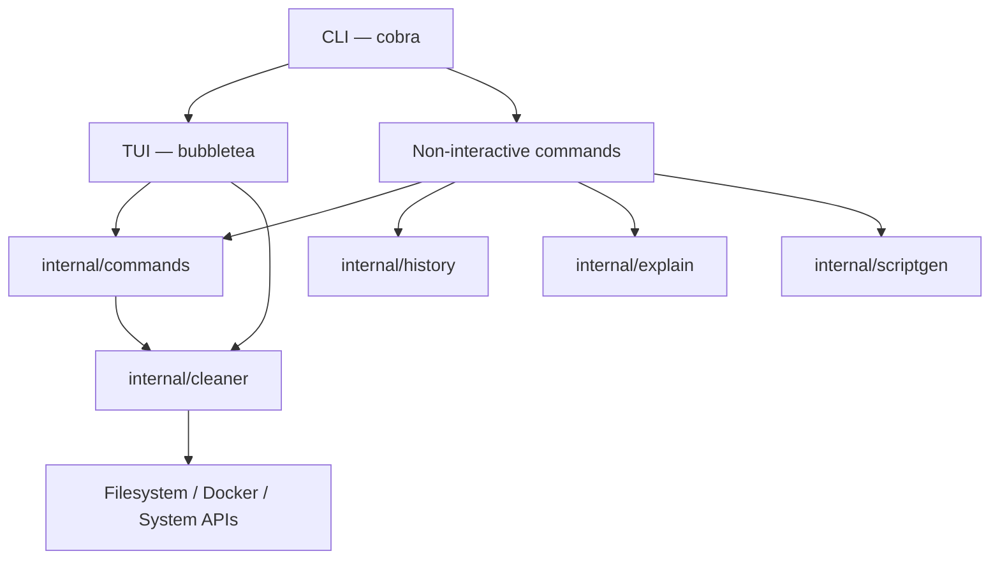
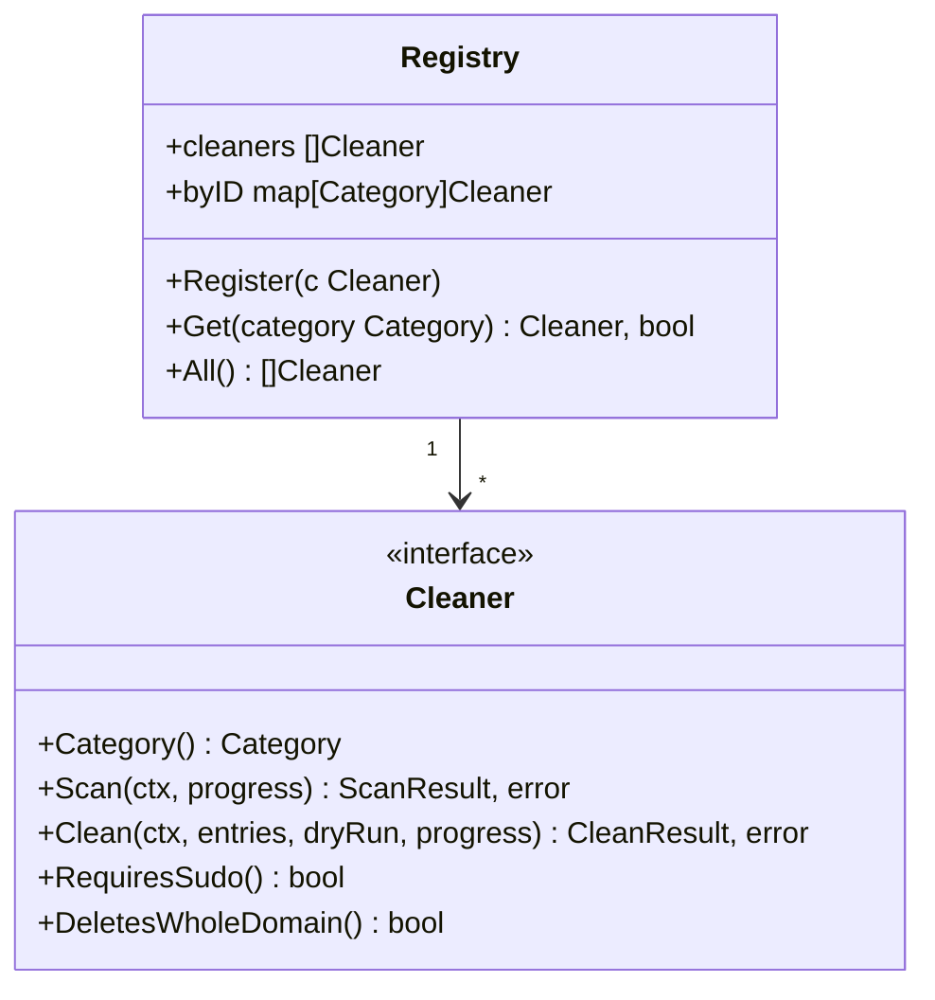
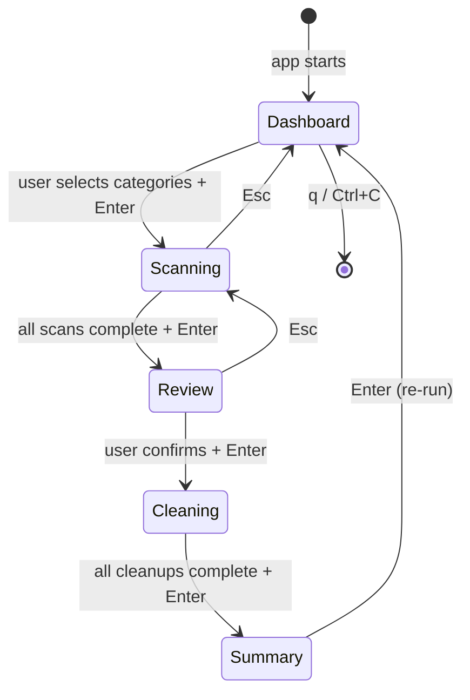
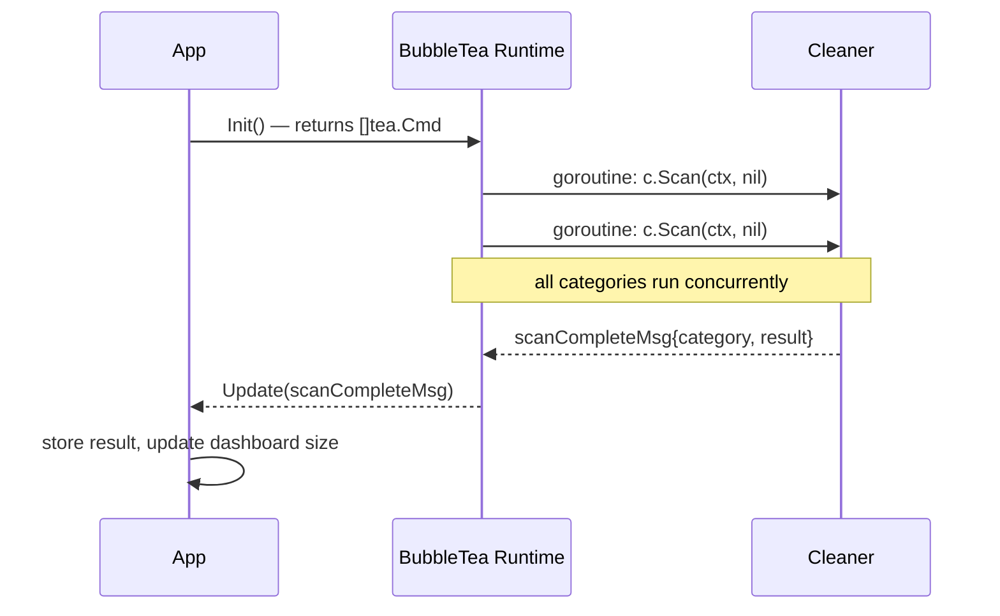
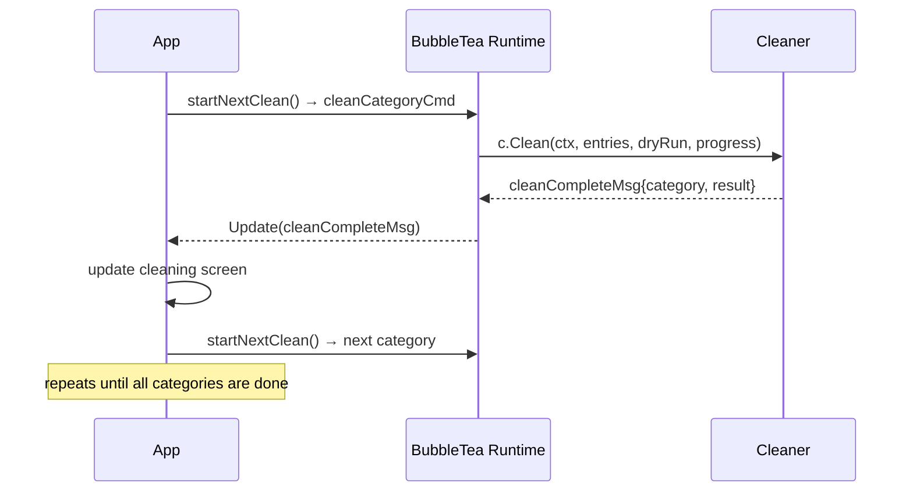
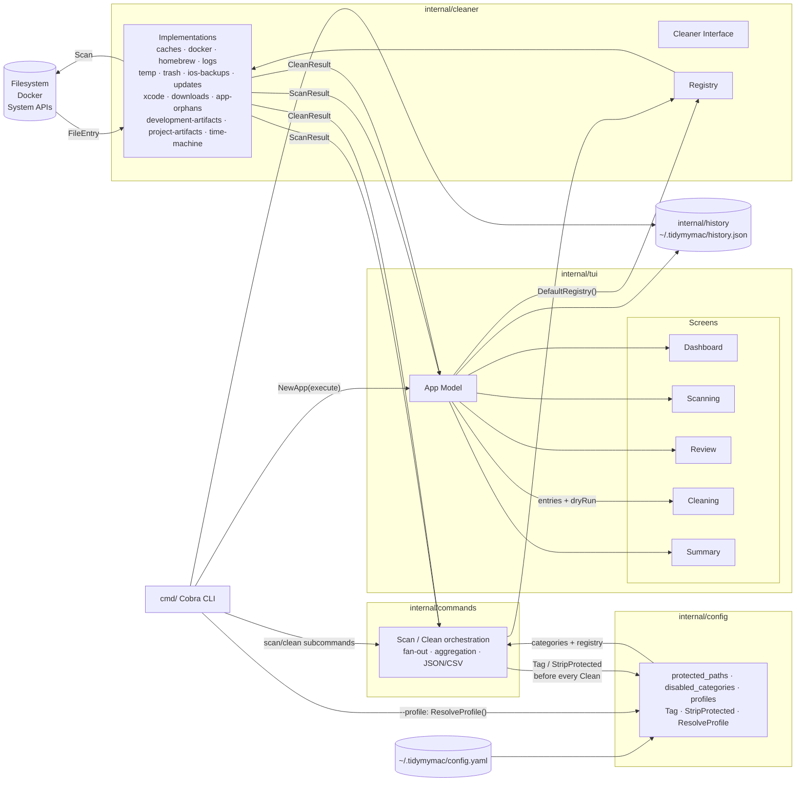
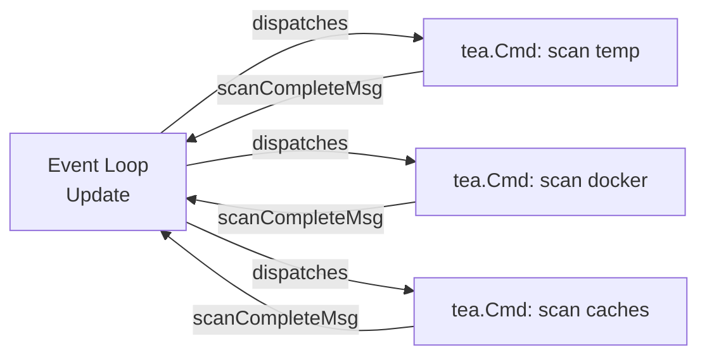
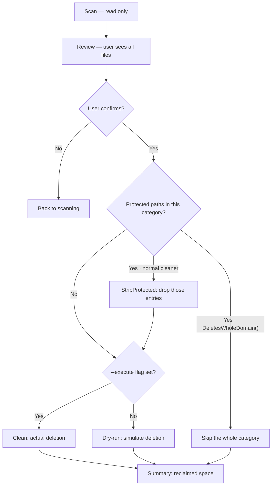
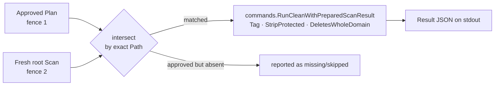

# TidyMyMac — Architecture

> An open-source macOS storage cleanup utility for developers.

This document describes the internal architecture of TidyMyMac: how the packages are organized, how data flows through the system, and the design decisions behind the key abstractions.

---

## Table of Contents

- [High-Level Overview](#high-level-overview)
- [Directory Structure](#directory-structure)
- [Core Abstractions](#core-abstractions)
  - [The Cleaner Interface](#the-cleaner-interface)
  - [The Registry](#the-registry)
  - [Results and Progress Types](#results-and-progress-types)
- [Package Breakdown](#package-breakdown)
  - [cmd/](#cmd)
  - [internal/cleaner/](#internalcleaner)
  - [internal/commands/](#internalcommands)
  - [internal/config/](#internalconfig)
  - [internal/elevate/](#internalelevate)
  - [internal/celebration/](#internalcelebration)
  - [internal/tui/](#internaltui)
  - [internal/history/](#internalhistory)
  - [internal/explain/](#internalexplain)
  - [internal/scriptgen/](#internalscriptgen)
  - [internal/buildinfo/](#internalbuildinfo)
  - [pkg/utils/](#pkgutils)
- [TUI Flow](#tui-flow)
  - [Screen State Machine](#screen-state-machine)
  - [Scan Lifecycle](#scan-lifecycle)
  - [Clean Lifecycle](#clean-lifecycle)
- [Data Flow Diagram](#data-flow-diagram)
- [Concurrency Model](#concurrency-model)
- [Safety Model](#safety-model)
- [Elevation Model](#elevation-model)
- [Extending TidyMyMac](#extending-tidymymac)

---

## High-Level Overview

TidyMyMac is structured in three main layers:


```mermaid
graph TD
    A[CLI — cobra] --> B[TUI — bubbletea]
    A --> C[Non-interactive commands]
    B --> CMD[internal/commands]
    C --> CMD
    CMD --> D[internal/cleaner]
    B --> D
    D --> E[Filesystem / Docker / System APIs]
    C --> H[internal/history]
    C --> EXP[internal/explain]
    C --> SG[internal/scriptgen]
```

The **CLI layer** (`cmd/`) parses arguments and either launches the interactive TUI or runs a non-interactive command (like `scan`, `clean`, `list`, `stats`, `explain`, `history`, `version`). The **cleaner layer** (`internal/cleaner/`) is the core domain: it defines a common `Cleaner` interface and holds all individual implementations. The **commands layer** (`internal/commands/`) wraps the cleaner layer with reusable scan/clean orchestration (fan-out, aggregation, JSON/CSV shaping) that both the CLI subcommands and the TUI consume. The **TUI layer** (`internal/tui/`) drives the interactive experience, delegating all actual work back to the cleaner and commands layers.

---

## Directory Structure

```
tidymymac/
├── cmd/                          # CLI entry points (cobra commands)
│   ├── tidymymac/                # main package — program entry point
│   ├── root.go                   # root command, launches TUI, loads config
│   ├── scan.go                   # `tidymymac scan`
│   ├── clean.go                  # `tidymymac clean`
│   ├── list.go                   # `tidymymac list categories|protected|profiles`
│   ├── profile.go                # `tidymymac profile <subcommand>`
│   ├── protect.go                # `tidymymac protect --path`
│   ├── unprotect.go              # `tidymymac unprotect --path`
│   ├── stats.go                  # `tidymymac stats [category]`
│   ├── explain.go                # `tidymymac explain <topic>`
│   ├── history.go                # `tidymymac history`
│   ├── elevated_clean.go         # hidden `internal-elevated-clean` (root helper entry point)
│   └── version.go                # `tidymymac version`
│
├── internal/
│   ├── cleaner/                  # core domain: interface, registry, implementations
│   │   ├── registry.go           # Cleaner interface + Registry struct
│   │   ├── category.go           # Category type and display names
│   │   ├── results.go            # FileEntry, ScanResult, CleanResult, progress types
│   │   ├── app_orphans.go        # Leftovers from uninstalled apps cleaner
│   │   ├── caches.go             # Application Caches cleaner
│   │   ├── development_artifacts.go # Go build/mod cache cleaner
│   │   ├── docker.go             # Docker artifacts cleaner
│   │   ├── downloads.go          # Installers and large items in ~/Downloads cleaner
│   │   ├── homebrew.go           # Homebrew cache cleaner
│   │   ├── ios_backups.go        # iOS Backups cleaner
│   │   ├── logs.go               # System Logs cleaner
│   │   ├── project_artifacts.go  # Junk dirs/large files in profile-configured project paths
│   │   ├── temp.go               # Temporary Files cleaner
│   │   ├── time_machine.go       # Time Machine local snapshots cleaner
│   │   ├── trash.go              # Trash cleaner
│   │   ├── updates.go            # macOS Software Updates cleaner
│   │   ├── xcode.go              # Xcode DerivedData/archives/simulators cleaner
│   │   └── utils.go              # Shared helpers (walk, size calculation, etc.)
│   │
│   ├── commands/                 # Reusable scan/clean orchestration shared by CLI and TUI
│   │   ├── scan.go               # Parallel fan-out scan + JSON/CSV rendering
│   │   ├── scan_input.go         # Category argument parsing/validation
│   │   └── clean.go              # Sequential clean orchestration + result aggregation
│   │
│   ├── config/                   # Safety config at ~/.tidymymac/config.yaml
│   │   ├── config.go             # Load/normalize, protected-path matching, ResolveProfile
│   │   ├── write.go              # yaml.Node surgery for protected_paths + atomic write
│   │   └── write_profiles.go     # Same, for the profiles tree
│   │
│   ├── elevate/                  # Privilege boundary: sudo helper + plan protocol
│   │   ├── elevate.go            # Plan/Result IPC types and schema versions
│   │   ├── planfile.go           # fd-based plan-file validation
│   │   ├── helper.go             # RunHelper — the root side (guards, intersection)
│   │   └── invoke.go             # Invoke — the unprivileged side (sudo, stdout capture)
│   │
│   ├── celebration/              # Post-cleanup celebration message selection
│   │   └── celebration.go        # Winner selection, random template, size analogy
│   │
│   ├── tui/                      # BubbleTea TUI application
│   │   ├── app.go                # Root model — manages screen transitions
│   │   ├── keys.go               # Keyboard bindings
│   │   ├── styles/               # Lipgloss styles, logo, tagline
│   │   └── screens/              # Individual screen models
│   │       ├── dashboard.go
│   │       ├── scanning.go
│   │       ├── review.go
│   │       ├── cleaning.go
│   │       ├── summary.go
│   │       └── health.go
│   │
│   ├── history/                  # Cleanup run history persisted at ~/.tidymymac/history.json
│   │   ├── history.go            # Load/append/Stats/StatsByCategory
│   │   └── utils.go              # File I/O helpers
│   │
│   ├── explain/                  # `explain` command: composes contributor data into storage topics
│   │   ├── topic.go              # Topic type (e.g. system-data)
│   │   ├── registry.go           # Topic registry + ResolveTopic
│   │   ├── contributors.go       # Per-category contributors (how each category feeds a topic)
│   │   ├── wrapper.go            # Runs the topic and formats the result
│   │   └── utils.go
│   │
│   ├── scriptgen/                # Shell cleanup script generation from scan results
│   │   └── scriptgen.go
│   │
│   └── buildinfo/                # Version/commit/date ldflag variables for `version` command
│       └── buildinfo.go
│
├── pkg/
│   └── utils/
│       ├── disk.go               # Disk usage helpers
│       └── format.go             # Human-readable size formatting
│
├── docs/                         # Documentation and images
├── bin/                          # Compiled binary (gitignored)
├── Makefile
└── go.mod
```

---

## Core Abstractions

### The Cleaner Interface

Every cleanup category is modeled as a `Cleaner`. The interface lives in `internal/cleaner/registry.go` and is the central contract of the entire system:

```go
type Cleaner interface {
    Category()     Category
    Name()         string
    Description()  string
    Scan(ctx context.Context, progress func(ScanProgress)) (*ScanResult, error)
    Clean(ctx context.Context, entries []FileEntry, dryRun bool, progress func(CleanProgress)) (*CleanResult, error)
    RequiresSudo() bool
    DeletesWholeDomain() bool
}
```

The separation between `Scan` and `Clean` is intentional and enforces the core safety guarantee: **nothing is ever deleted as a side effect of scanning**. A scan produces a `ScanResult` with candidate `FileEntry` items; deletion only happens when `Clean` is explicitly called with those entries.

`DeletesWholeDomain()` is the escape hatch for cleaners that cannot honor a filtered entry list. Homebrew, Development Artifacts and Trash shell out to a command (`brew cleanup`, `go clean -cache -modcache`, Finder's "empty trash") that clears their entire domain regardless of what they were handed. Callers must never invoke `Clean` on such a cleaner when any entry was withheld — see [Safety Model](#safety-model).

### Optional Interfaces

`EntryRevalidator` (also in `registry.go`) is an **optional** interface a cleaner may additionally implement:

```go
type EntryRevalidator interface {
    RevalidateEntries(ctx context.Context, entries []FileEntry) (revalidated []FileEntry, missing int, typeChanged int, err error)
}
```

It exists because `clean --from-file` re-checks every saved entry before deleting anything, and its default check is `os.Stat(entry.Path)`. That is correct only while `Path` is a real filesystem path. `DockerCleaner` (`docker://image/<id>/<tag>`) and `TimeMachineCleaner` (`com.apple.TimeMachine.<date>.local`) use `Path` as a resource identifier, so `os.Stat` always fails and every entry would be silently dropped as "missing". Implementing this interface lets such a cleaner re-check its entries against its own backing store instead — `docker ps -a` / `docker images -a` / `docker volume ls`, and `tmutil listlocalsnapshots /`.

The returned `err` means *revalidation could not be performed at all* (daemon down, `tmutil` absent) and is deliberately distinct from "the entries are gone": `PrepareScanResultForClean` records it as that one category's error and leaves sibling categories untouched, rather than treating it as an empty result. Existence is the entire contract — deeper checks (is the image still dangling? has the container been stopped long enough?) belong to `Scan`.

A cleaner whose `Path` is a real filesystem path implements nothing and keeps the `os.Stat` path.

`PrivilegeSplitter` (also in `registry.go`) is an **optional** interface a `RequiresSudo` cleaner may additionally implement:

```go
type PrivilegeSplitter interface {
    NeedsSudo(entry FileEntry) bool
}
```

It lets a cleaner whose domain spans locations at different privilege levels — Temp's `/tmp`/`/var/tmp` versus the user's own `$TMPDIR` — have only the entries that genuinely need root sent to the elevated helper, with the rest cleaned directly by the unprivileged process. See [Privilege split](#privilege-split-not-everything-a-sudo-category-scans-needs-root) for the full mechanism and the two invariants an implementation must uphold. A cleaner that does not implement it keeps `RequiresSudo()`'s all-or-nothing behavior.

### The Registry

The `Registry` struct is a simple in-memory store that maps a `Category` to a `Cleaner` implementation:


```mermaid
classDiagram
    class Registry {
        +cleaners []Cleaner
        +byID map[Category]Cleaner
        +Register(c Cleaner)
        +Get(category Category) Cleaner, bool
        +All() []Cleaner
    }

    class Cleaner {
        <<interface>>
        +Category() Category
        +Scan(ctx, progress) ScanResult, error
        +Clean(ctx, entries, dryRun, progress) CleanResult, error
        +RequiresSudo() bool
        +DeletesWholeDomain() bool
    }

    Registry "1" --> "*" Cleaner
```

`DefaultRegistry()` wires up all built-in cleaners:

```go
func DefaultRegistry() *Registry {
    r := NewRegistry()
    r.Register(NewTempCleaner())
    r.Register(NewHomebrewCleaner())
    r.Register(NewCachesCleaner())
    r.Register(NewDevelopmentArtifactsCleaner())
    r.Register(NewProjectArtifactsCleaner(nil, 0, false))
    r.Register(NewLogsCleaner())
    r.Register(NewDockerCleaner())
    r.Register(NewIOSBackupsCleaner())
    r.Register(NewUpdatesCleaner())
    r.Register(NewDownloadsCleaner())
    r.Register(NewAppOrphansCleaner())
    r.Register(NewTrashCleaner())
    r.Register(NewXcodeCleaner())
    r.Register(NewTimeMachineCleaner())
    return r
}
```

`NewProjectArtifactsCleaner` is the one cleaner registered with no targets: its project roots come from a profile, so the default instance scans nothing until `config.ResolveProfile` substitutes a configured one (see [internal/config/](#internalconfig)).

The built-in categories (see `internal/cleaner/category.go`) are:

| Category constant | ID string | Display name |
|---|---|---|
| `CategoryTemp` | `temp` | Temporary Files |
| `CategoryHomebrew` | `homebrew` | Homebrew Cache |
| `CategoryApplicationCaches` | `app-caches` | Application Caches |
| `CategoryDevelopmentArtifacts` | `development-artifacts` | Development Artifacts |
| `CategoryProjectArtifacts` | `project-artifacts` | Project Artifacts |
| `CategoryLogs` | `logs` | System Logs |
| `CategoryDocker` | `docker` | Docker |
| `CategoryIOSBackups` | `ios-backups` | iOS Backups |
| `CategoryUpdates` | `macos-updates` | macOS Updates |
| `CategoryDownloads` | `downloads` | Downloads |
| `CategoryAppOrphans` | `app-orphans` | App Orphans |
| `CategoryTrashBin` | `trash` | Trash Files |
| `CategoryXcode` | `xcode` | Xcode |
| `CategoryTimeMachineSnapshots` | `time-machine` | Time Machine Snapshots |

Adding a new cleaner is purely additive — implement the interface, add a category constant, and register it (see [Extending TidyMyMac](#extending-tidymymac)).

### Results and Progress Types

All data flowing between the cleaner layer and the TUI is typed explicitly in `results.go`:

| Type | Purpose |
|---|---|
| `FileEntry` | A single file or directory found during a scan |
| `ScanResult` | Aggregate result of a full category scan |
| `ScanProgress` | Streamed progress update during scanning |
| `CleanResult` | Aggregate result of a cleanup operation |
| `CleanProgress` | Streamed progress update during cleaning |

`FileEntry` carries one field no `Scan` implementation may ever set: `Protected`. It is written exclusively by `internal/config`'s tagging layer, immediately before a clean, and is what `StripProtected` filters on.

`FileEntry.ResourceKind` is the opposite case: it is set by a `Scan` implementation and is purely descriptive. It classifies an entry for reporting so downstream code never has to parse `Path`. Today only `DockerCleaner` sets it, using the `DockerResourceKind*` constants in `docker.go` (`container_stopped`, `image_dangling`, `image_stopped_container`, `volume_orphaned`); every other cleaner leaves it empty. It exists because the `docker://image/...` path shape cannot distinguish a dangling image from an image kept alive by a stopped container. Deletion logic must not branch on it — `DockerCleaner.Clean` and `internal/scriptgen` still parse the `docker://<type>/<id>/<name>` path, which remains the stable contract. Adding a kind is additive: declare a constant and set it on the entries of the new scan step.

Progress callbacks (`func(ScanProgress)` and `func(CleanProgress)`) allow cleaners to stream partial results back to the TUI in real time, without coupling the cleaner layer to the UI.

---

## Package Breakdown

### `cmd/`

The `cmd/` package uses [Cobra](https://github.com/spf13/cobra) to define the CLI structure. The root command (`tidymymac`) launches the TUI in dry-run mode. Subcommands provide non-interactive alternatives:

| Command | Purpose |
|---|---|
| `execute` | Open the same interactive TUI as the root command, but already in execute mode. Deletion still goes through the TUI's own review and confirmation step. Prefer this over the deprecated `tidymymac --execute`. |
| `scan [categories...]` | Run scans and emit an interactive table or machine-readable JSON/CSV/table (with `--output json\|csv\|table`, `--detailed`, `--save`, `--quiet`, `--generate-script`). `--output table --detailed` prints a concise report (totals + top 10 largest items per category, Docker grouped by resource type); add `--print-all` to list every item instead of capping at 10 (only valid with `--output table --detailed`). `--profile <name>` runs a configured profile instead of positional categories. |
| `clean [categories...]` | Delete scanned files. Dry-run by default; destructive only with `--execute`. Supports `--from-file` to reuse a previously saved detailed scan, `--output json`, `--profile <name>`, `--include-large-files` to opt into deleting the oversized files a profile's project paths turn up, and `--prompt-sudo` to allow `--execute --output json` to prompt for a sudo password when the prepared plan has entries that genuinely need root. Prompting requires a controlling terminal and terminal stderr; stdin may still carry `--from-file -`. |
| `list categories\|protected\|profiles` | Print all registered categories (add `--detailed` for descriptions), the current safety config, or the configured profiles. |
| `profile <subcommand>` | `create`, `delete`, `add-category`, `remove-category`, `add-path`, `remove-path` — CRUD over the `profiles` tree in the config file. |
| `protect --path` / `unprotect --path` | Add or remove an entry in `protected_paths`. |
| `stats [category]` | Aggregate all-time statistics from the local history store. |
| `explain <topic>` | Explain a macOS storage topic (e.g. `system-data`) by composing contributor data from multiple cleaners. |
| `history` | Show past cleanup runs. |
| `version` | Print version, commit, build date, platform, and Go version (values come from `internal/buildinfo`). |

The root command's `PersistentPreRunE` loads `internal/config` once for **every** subcommand and stores it in `loadedConfig`, so no subcommand can accidentally run with protection disabled. A malformed config aborts the command rather than falling back to an empty one.

The `--execute` flag is defined at the root level as a persistent flag, making it available to both the root command and any subcommand that performs deletions:

```go
rootCmd.PersistentFlags().BoolVarP(&executeFlag, "execute", "e", false,
    "execute deletions when cleaning ('clean --execute'); deprecated for the root TUI - use 'tidymymac execute' instead")
```

Using `--execute` directly on the root command (e.g. `tidymymac --execute`) still opens the TUI in execute mode for backward compatibility, but emits a one-line deprecation warning to stderr pointing at `tidymymac execute`. `clean --execute` is unaffected by this warning — it reads the same `executeFlag` variable but is a separate `RunE`.

### `internal/cleaner/`

This is the heart of the project. Each file in this package implements the `Cleaner` interface for a specific category. Implementations are self-contained: they know which paths to scan, how to calculate sizes, and how to safely delete their targets.

Shared filesystem utilities (directory walking, size aggregation) live in `utils.go` and are used internally across implementations. Cleaners that shell out to external tools (e.g. `docker` for `docker.go`, `tmutil` for `time_machine.go`) gracefully degrade to an empty scan result when the tool is absent, so the TUI and the non-interactive commands remain usable on any Mac.

The cleaners that report `RequiresSudo()` and target paths under the user's home (`temp.go`, `logs.go`, `updates.go`) resolve it through `internal/homedir.Resolve()` rather than `os.UserHomeDir()`. These are precisely the cleaners that can end up running elevated, where `os.UserHomeDir()` would return root's home (`/var/root`) and the cleaner would scan and clean the wrong home entirely; `homedir.Resolve` short-circuits on `euid == 0` + `SUDO_USER` to the invoking user's real home. `internal/config` uses the same resolver for the same reason.

Known system aliases are canonicalized before use (`resolveScanRoots`). That is not cosmetic: macOS ships `/tmp` as a symlink to `private/tmp`, and `filepath.WalkDir` only `Lstat`s its root — handed a symlink it reports that symlink as the single entry and never descends. `"/tmp"` as a scan root therefore produced exactly one candidate, `/tmp` itself, and nothing beneath the most security-relevant directory the Temp cleaner covers was ever scanned, reviewed or cleaned. Only the fixed, system-owned roots `/tmp`, `/var/tmp`, and `/var/log` may have their aliases followed. Arbitrary roots — especially user-writable paths such as `~/Library/Logs` — are deliberately left untouched, so a symlink cannot redefine a cleaner's privileged deletion domain (for example by pointing Logs at `/etc`). The visible consequence for trusted aliases is that entries are reported under their canonical spelling — `/private/tmp/...`, `/private/var/log/...`. `protected_paths` is unaffected: `internal/config` stores each protected entry under its literal spelling, its firmlink alias, and its `EvalSymlinks` resolution.

Those same three cleaners also never delete by pathname. Each one resolves its **scan roots once, at construction** (`tempScanRoots` / `logsScanRoots` / `updatesScanRoots`) into a `roots` field that both `Scan` and `Clean` read, so the set of directories a cleaner walks and the set it is allowed to delete inside cannot drift apart. `Clean` then routes every removal through `rootedRemover` (`saferemove.go`), which performs the unlink relative to an `os.Root` anchored at one of those roots instead of calling `os.Remove` on the absolute path. See [Confined removal](#confined-removal) for why that distinction is the whole point.

For the same reason, `temp.go` does not trust `os.TempDir()` (i.e. `$TMPDIR`) verbatim. A scan root is exactly what the elevated helper's fence 2 treats as a category's legitimate domain, so an environment variable that becomes a scan root is an environment variable that can nominate a directory for root-privileged deletion. `userTempRoot` accepts it only when it resolves under a genuine macOS temp root (`/var/folders`, `/private/var/folders`, `/tmp`, `/private/tmp`) and drops it entirely when `euid == 0` — the elevated path already covers `/tmp` and `/var/tmp` explicitly.

### `internal/commands/`

This package contains the reusable orchestration logic that both the Cobra subcommands and (increasingly) the TUI depend on. It exists so that the same behavior — argument parsing, category filtering, parallel scan fan-out, JSON/CSV shaping, sequential clean execution, error aggregation — is implemented exactly once.

- `scan.go` — runs `Scan` across the registry concurrently using a `sync.WaitGroup`, then produces a `ScanCategoryResult` per category. Supports `Detailed` mode (which includes the full `[]FileEntry` list) and JSON/CSV/table writers via `WriteOutput`. The table writer (`--output table`) is a plain-text, non-interactive report — separate from the lipgloss-styled interactive scan table in `cmd/scan.go` — that groups Docker entries by `FileEntry.ResourceKind` and caps every category/group at 10 entries unless `--print-all` is set; JSON/CSV remain untruncated regardless.
- `scan_input.go` — normalizes user-provided category arguments against the registry and returns a filtered subset (or a helpful error listing valid categories).
- `clean.go` — runs `Clean` sequentially, aggregating per-category results into a single `CleanResult` structure suitable for the CLI or TUI summary.

Note that this package has **no profile-specific code**. It already accepts an arbitrary `*cleaner.Registry` plus a `[]string` of selected categories, which is exactly what `config.ResolveProfile` returns — so `--profile` is resolved in the `cmd/` layer and flows through the existing pipeline unchanged.

### `internal/config/`

The safety layer, backed by `~/.tidymymac/config.yaml` (see [docs/CONFIGURATION.md](CONFIGURATION.md) for the user-facing format). It owns three independent settings — `protected_paths`, `disabled_categories` and `profiles` — and the code that enforces them.

**Loading.** `Load()` decodes with `KnownFields(true)`, so an unrecognized key is a hard error rather than a silent zero-value config: running as if `protected_paths` were empty while the user believes it is active is the worst failure mode this package can have. A missing or empty file is *not* an error, but it still goes through `normalize()` (see built-in defaults below). `normalize()` pre-computes the comparison form of every protected path (tilde-expanded, cleaned, case-folded, plus macOS firmlink aliases and resolved symlinks). It deliberately does **not** validate profiles: a broken profile is not a safety risk until it is used, and failing `Load` would block every command, including ones that never touch profiles.

**Built-in protected paths.** `builtinProtectedPaths` in `config.go` ships two hard-blocked defaults that require no config file: `~/.ollama/models` (Ollama local models) and `~/.cache/huggingface` (Hugging Face Hub cache, models + Xet cache). Local model stores are huge and look exactly like regenerable cache to a generic scanner, so they are protected out of the box. `normalize()` unions them in *before* the user's `protected_paths` (dedup keeps the built-in origin), and every normalized root carries a `builtin` flag. They live only in memory — they are never written to `config.yaml`, so `protect`/`unprotect`'s file editing never sees them. `IsBuiltinProtected(path)` lets `unprotect` say "built-in, cannot be removed" instead of wrongly reporting "not protected", and `ProtectedPathEntries()` gives `list protected` the built-in/user origin plus each built-in's reason. Deliberately out of scope: app caches under `~/Library/Caches` (regenerable by design), LM Studio and llama.cpp (no stable model-store default path), and `OLLAMA_MODELS`/`HF_HOME`/`HF_HUB_CACHE` env-var detection — a relocated store is added to `protected_paths` by the user.

**Enforcement.** These functions are what the clean pipeline calls, in this order:

| Function | Role |
|---|---|
| `IsProtected(path)` | Path is a protected root, or nested under one. |
| `ContainsProtected(path)` | A protected root is nested *inside* path — the reverse check, for directory entries recorded as whole units. |
| `Tag(entries)` | Marks `FileEntry.Protected` where either check matches (containment only applies to `IsDir` entries). Never removes anything: scans and dry-runs must still show protected files. |
| `CountProtected(entries)` | Used to decide whether a `DeletesWholeDomain()` cleaner must be skipped entirely. |
| `StripProtected(entries)` | The hard block — drops tagged entries immediately before `Clean` and before any generated script. |
| `FilterRegistry(r, cfg)` | Applies `disabled_categories`, but only where there is no explicit user selection to take precedence. |

**Profile resolution.** `ResolveProfile(base, name, includeLargeFiles)` returns the `(categories, registry)` pair described above. When a profile has project paths, it rebuilds the registry from `base.All()` with a configured `ProjectArtifactsCleaner` substituted in place — rebuilt rather than re-`Register`ed, because `Register` replaces the `byID` entry but *appends* to the ordered slice, which would leave `All()` returning the cleaner twice. Profile paths are re-validated here, so a hand-edited entry fails only that profile.

**Writing.** `write.go` and `write_profiles.go` edit the file as a `yaml.Node` tree rather than re-marshalling a struct, which is what preserves hand-written comments. Every write is atomic (temp file + rename, mirroring `internal/history`) and is followed by a reload that must still satisfy `Load`'s invariants — catching a node-surgery bug at `protect`/`profile` time instead of on the next real clean. An already-invalid file is refused rather than patched around.

### `internal/elevate/`

The privilege boundary. It lets categories that genuinely need root (`temp`, `logs`, `macos-updates`) be cleaned without the user ever starting the whole application under `sudo`. See [Elevation Model](#elevation-model) for the design; the package exposes exactly four things:

| Symbol | Role |
|---|---|
| `Plan` / `PlanCategory` | The approved work sent to the helper: schema version, dry-run flag, and per-category approved entries. |
| `Result` / `CategoryIntersection` | What the helper sends back: a `commands.CleanResult` plus per-category `Approved`/`Matched`/`Missing` counts. |
| `Invoke(ctx, plan)` | Unprivileged side. Re-executes this binary under `sudo` and decodes the helper's result. |
| `RunHelper(ctx, planPath)` | Root side. Runs the guards, the intersection, and the normal clean pipeline. |

`HelperCommandName` (`internal-elevated-clean`) is exported only so `cmd/elevated_clean.go` can register the hidden command under exactly the name `Invoke` passes to `sudo`.

`tidymymac execute` (the TUI) calls `Invoke` from `internal/tui/app.go`'s `startElevation`/`handleElevateComplete`: the review screen's sudo dialog lets the user Authenticate or Skip, and on Authenticate the terminal is handed to `sudo`'s native password prompt via bubbletea's `tea.Exec` (the same mechanism used to shell out to an external editor) before `Invoke` runs. The interactive `clean --execute` (table output) calls it too, transparently, via `cmd/clean.go`'s `resolveSudoElevation`/`elevateForClean`, before any bubbletea `Program` starts — one password authenticates every sudo category in the run. `clean --execute --output json` is the automation surface and has the opposite default: it first prepares and privilege-splits the approved entries without deleting anything. If the resulting plan contains privileged entries, the run is refused unless invoked as `clean --execute --output json --prompt-sudo` with a controlling terminal and terminal stderr. Stdin is deliberately not required to be a terminal, so `--from-file -` remains compatible. Authentication/helper failure aborts before direct entries or ordinary categories start; a non-interactive process therefore never hangs on a password prompt or silently completes only the unprivileged half.

### `internal/celebration/`

`celebration` picks the single celebration message shown after a real (non-dry-run) cleanup, both in the CLI (`cmd/clean.go`) and in the TUI summary screen. `Message(results)` selects the successful category that reclaimed the most space — failed categories and zero-byte results are excluded, so space is never celebrated when it wasn't actually freed — and renders a random template with the freed size plus an approximate real-world analogy ("about 4 HD TV episodes at ~500.0 MB each") derived from a sorted table of reference sizes. It returns an empty string when there is nothing worth celebrating, and callers simply skip rendering in that case.

### `internal/tui/`

The TUI is built on [BubbleTea](https://github.com/charmbracelet/bubbletea), which follows the Elm architecture: **Model → Update → View**.

The root model is `App` in `app.go`. It holds the current screen state, all screen sub-models, and the cleaner registry. Screen transitions happen inside the `Update` method based on keyboard messages and async results.

Individual screens (`screens/`) are separate structs that expose a `View()` string and handler methods, but they do **not** implement `tea.Model` themselves — `App` owns the entire update loop and delegates to the appropriate screen based on `currentScreen`. Lipgloss styles, the logo and the tagline live in `internal/tui/styles/` so they can be reused by both the TUI and the CLI output (e.g. `list categories`, `stats`).

### `internal/history/`

`history` owns the persistent cleanup-run record stored at `~/.tidymymac/history.json`. It exposes:

- `Load()` — read or create the history file.
- `Append(run)` — append a new run after a successful cleanup.
- `Stats(record)` / `StatsByCategory(record, category)` — reduce the record into an `AllTimeStats` structure (total runs, total files, total bytes, average, last run).

The `history` and `stats` CLI commands and the TUI summary screen all consume this package; no other layer reads or writes the history file directly.

### `internal/explain/`

The `explain` command composes read-only information from multiple cleaners into a higher-level **storage topic** (today: `system-data`). Key types:

- `Topic` — a topic identifier plus `DisplayName()`.
- `Registry` / `TopicDefinition` — maps a topic to the contributors that feed into it. `TopicDefinition.Aliases` holds every name the topic answers to; the first is canonical.
- `Contributor` — a per-category adapter that produces narrative data for a topic (e.g. how Xcode and Docker contribute to "System Data").
- `ResolveTopic`, `RunTopic`, `FormatTopicResult` — public entry points used by `cmd/explain.go`.

A *topic* is deliberately distinct from a cleanup *profile* (`internal/config`): a topic is a macOS storage concept the user asks about and cannot configure, while a profile is a user-authored bundle of categories and paths. These were both called "profile" until the rename.

Because contributors are read-only, `explain` never deletes anything and never needs the `--execute` flag.

### `internal/scriptgen/`

`scriptgen` takes a detailed `ScanResult` (or set of results) and produces a self-contained shell script that the user can review and run manually. This powers `scan --generate-script` and lets users decouple reviewing from executing: the script embeds the exact paths found, so there is no re-scan between preview and delete.

### `internal/buildinfo/`

A tiny package holding `Version`, `Commit`, `Date` variables populated at build time via `-ldflags`. `cmd/version.go` reads these to render the output of `tidymymac version`. Isolated into its own package so both the CLI and any tests can access it without pulling in Cobra.

### `pkg/utils/`

Public utilities that could potentially be reused outside the `internal/` boundary. Currently contains disk usage helpers and human-readable byte formatting.

---

## TUI Flow

### Screen State Machine


```mermaid
stateDiagram-v2
    [*] --> Dashboard : app starts
    Dashboard --> Scanning : user selects categories + Enter
    Scanning --> Review : all scans complete + Enter
    Review --> Cleaning : user confirms + Enter
    Cleaning --> Summary : all cleanups complete + Enter
    Summary --> Dashboard : Enter (re-run)

    Dashboard --> [*] : q / Ctrl+C
    Scanning --> Dashboard : Esc
    Review --> Scanning : Esc
```

### Scan Lifecycle

When the app starts, `Init()` immediately fires a `tea.Cmd` for each registered cleaner to run in a goroutine. This means all categories are scanned **in parallel** from the very first frame. Results come back as `scanCompleteMsg` values that the `Update` loop processes one at a time:


```mermaid
sequenceDiagram
    participant App
    participant BubbleTea Runtime
    participant Cleaner

    App->>BubbleTea Runtime: Init() — returns []tea.Cmd
    BubbleTea Runtime->>Cleaner: goroutine: c.Scan(ctx, nil)
    BubbleTea Runtime->>Cleaner: goroutine: c.Scan(ctx, nil)
    Note over BubbleTea Runtime,Cleaner: all categories run concurrently
    Cleaner-->>BubbleTea Runtime: scanCompleteMsg{category, result}
    BubbleTea Runtime-->>App: Update(scanCompleteMsg)
    App->>App: store result, update dashboard size
```

If the user navigates to the Scanning screen and a result is already cached from the background scan, it's reused immediately — no duplicate work.

### Clean Lifecycle

Unlike scanning, cleanup is **sequential** — one category at a time. This is a deliberate design choice to avoid interleaved filesystem operations and make progress reporting straightforward. After each category finishes, `handleCleanComplete` calls `startNextClean()` to fire the next one:


```mermaid
sequenceDiagram
    participant App
    participant BubbleTea Runtime
    participant Cleaner

    App->>BubbleTea Runtime: startNextClean() → cleanCategoryCmd
    BubbleTea Runtime->>Cleaner: c.Clean(ctx, entries, dryRun, progress)
    Cleaner-->>BubbleTea Runtime: cleanCompleteMsg{category, result}
    BubbleTea Runtime-->>App: Update(cleanCompleteMsg)
    App->>App: update cleaning screen
    App->>BubbleTea Runtime: startNextClean() → next category
    Note over App: repeats until all categories are done
```

---

## Data Flow Diagram

End-to-end data flow from filesystem to screen:


```mermaid
flowchart LR
    FS[(Filesystem\nDocker\nSystem APIs)]

    subgraph internal/cleaner
        CI[Cleaner Interface]
        REG[Registry]
        IMPL[Implementations\ncaches · docker · homebrew · logs\ntemp · trash · ios-backups · updates\nxcode · downloads · app-orphans\ndevelopment-artifacts · project-artifacts · time-machine]
    end

    subgraph internal/commands
        CMDS[Scan / Clean orchestration\nfan-out · aggregation · JSON/CSV]
    end

    subgraph internal/config
        CFG[protected_paths · disabled_categories · profiles\nTag · StripProtected · ResolveProfile]
    end

    subgraph internal/tui
        APP[App Model]
        subgraph Screens
            DASH[Dashboard]
            SCAN[Scanning]
            REV[Review]
            CLEAN[Cleaning]
            SUM[Summary]
        end
    end

    CLI[cmd/ Cobra CLI]
    HIST[(internal/history\n~/.tidymymac/history.json)]
    YAML[(~/.tidymymac/config.yaml)]

    YAML --> CFG
    CLI -->|"NewApp(execute)"| APP
    CLI -->|scan/clean subcommands| CMDS
    CLI -->|"--profile: ResolveProfile()"| CFG
    CFG -->|"categories + registry"| CMDS
    CMDS --> REG
    APP -->|"DefaultRegistry()"| REG
    REG --> IMPL
    IMPL -->|Scan| FS
    FS -->|FileEntry| IMPL
    IMPL -->|ScanResult| CMDS
    CMDS -->|"Tag / StripProtected\nbefore every Clean"| CFG
    IMPL -->|ScanResult| APP
    APP --> DASH
    APP --> SCAN
    APP --> REV
    APP -->|"entries + dryRun"| CLEAN
    IMPL -->|CleanResult| APP
    IMPL -->|CleanResult| CMDS
    APP --> SUM
    APP --> HIST
    CLI --> HIST
```

---

## Concurrency Model

TidyMyMac relies entirely on BubbleTea's concurrency model. There are **no manually managed goroutines or channels** in application code.

`tea.Cmd` is a `func() tea.Msg` — BubbleTea runs it in a goroutine and delivers the result as a message to `Update`. This means:

- All scans run concurrently as separate `tea.Cmd` goroutines
- The UI never blocks — the event loop always remains responsive
- Cancellation is handled via a `context.Context` stored in `App`, with `cancel()` called on quit


```mermaid
graph LR
    EC[Event Loop\nUpdate] -->|dispatches| CMD1[tea.Cmd: scan temp]
    EC -->|dispatches| CMD2[tea.Cmd: scan docker]
    EC -->|dispatches| CMD3[tea.Cmd: scan caches]
    CMD1 -->|scanCompleteMsg| EC
    CMD2 -->|scanCompleteMsg| EC
    CMD3 -->|scanCompleteMsg| EC
```

---

## Safety Model

The entire system is designed around a single invariant: **files are never touched without explicit user confirmation**.

This is enforced at multiple levels:

1. **Interface contract**: `Scan` and `Clean` are separate methods. Scanning never has side effects.
2. **Dry-run by default**: The `dryRun` flag is `true` unless the user passes `--execute`. Cleaners receive this flag and must respect it.
3. **Confirmed entries only**: `Clean` receives only the `[]FileEntry` that the user explicitly reviewed and confirmed in the Review screen — not the full scan result.
4. **Context cancellation**: If the user quits mid-operation, `cancel()` is called, and cleaners are expected to respect `ctx.Done()`.
5. **Protected paths are a hard block**: `config.StripProtected` runs immediately before *every* `Clean` invocation and before any generated deletion script, unconditionally. There is no CLI flag that overrides `protected_paths` — by design. Protection is not filtering: `Tag` only marks entries, so scans and dry-run previews still *show* protected files, they simply are never passed to `Clean`. Containment applies in both directions, so a directory entry that contains a protected path is protected as a whole (deleting it would take the protected path with it).
6. **Whole-domain cleaners skip rather than under-honor**: when a protected path lands in a category whose cleaner reports `DeletesWholeDomain()`, there is no way to run it while sparing that path. The category is skipped entirely, with an error explaining why, instead of running with a silently-filtered list.
7. **Privileges are scoped, not global**: root is never granted to the whole program. Only the deletion of an already-approved plan runs elevated, and even then it is re-bounded by a fresh root scan — see [Elevation Model](#elevation-model).
8. **`disabled_categories` is a default, never a veto**: naming a category explicitly runs it, whether or not it needs root. The elevated helper does not consult it either — enforcing it only for privileged categories gave the CLI two contradictory policies separated by nothing but a privilege requirement, and it is not a security control (what bounds an elevated plan is the category being known and `RequiresSudo`, plus fence 2). A hard, plan-vetoing block, if ever wanted, belongs in its own config concept.
9. **The program refuses to delete while it is itself root**: `sudo tidymymac clean --execute` (or `sudo tidymymac execute`) bypasses the elevation model entirely — there is no plan/fresh-scan intersection, and `RequiresSudo() == false` never meant "cannot run as root", only "the helper will not accept this category in a plan". Every execute-mode entry point calls `guardRootDeletion` (`cmd/root_privileges.go`) and refuses. Dry runs are unaffected. The hidden helper is exempt by construction: the guard lives in each `RunE`, never in the shared `PersistentPreRunE`.
10. **Deletion is confined to the scanning domain**: the cleaners that can run elevated (`temp`, `logs`, `macos-updates`) do not call `os.Remove` on a path string. Every removal goes through an `os.Root` anchored at one of that cleaner's own scan roots, so a path component swapped for a symlink between approval and deletion cannot redirect the unlink out of the domain — see [Confined removal](#confined-removal).
11. **A sudo category only elevates the part of itself that needs it**: `RequiresSudo()` bounds what a category is *allowed* to elevate, not what it *must*. A cleaner that implements `PrivilegeSplitter` (currently Temp) has its approved entries partitioned so only the ones that genuinely need root reach the plan; the rest are cleaned directly and unprivileged. In the automation path that direct work starts only after successful elevation; in the TUI it starts asynchronously after the reviewed deletion is confirmed and before the terminal is handed to sudo — see [Privilege split](#privilege-split-not-everything-a-sudo-category-scans-needs-root).


```mermaid
flowchart TD
    A[Scan — read only] --> B[Review — user sees all files]
    B --> C{User confirms?}
    C -- No --> D[Back to scanning]
    C -- Yes --> P{Protected paths in this category?}
    P -- "Yes · DeletesWholeDomain()" --> S[Skip the whole category]
    P -- "Yes · normal cleaner" --> T[StripProtected: drop those entries]
    P -- No --> E
    T --> E{--execute flag set?}
    E -- No --> F[Dry-run: simulate deletion]
    E -- Yes --> G[Clean: actual deletion]
    G --> H[Summary: reclaimed space]
    F --> H
    S --> H
```

---

## Elevation Model

Some categories cannot be cleaned without root. The naive answer — tell the user to run `sudo tidymymac` — makes *every* line of the program run as root, including the TUI, the config loader and every cleaner that never needed privileges. `internal/elevate` exists so that only the deletion of already-approved items runs elevated.

The flow is: the unprivileged process scans and gets the user's approval, then re-executes **itself** under `sudo` with one narrow job, handing over a `Plan`.

### The two-fence intersection

A root process that deletes whatever list it is handed is a confused deputy. So the helper never trusts the plan alone. It deletes only the **intersection** of two independent fences:

| Fence | What it bounds | Produced by |
|---|---|---|
| 1 — intent | what the human actually reviewed and approved | the `Plan` |
| 2 — domain | what the category legitimately owns *right now* | a fresh `Cleaner.Scan()` run as root |

- A tampered plan pointing at `~/Documents` passes fence 1 but can never pass fence 2, because no cleaner's `Scan` returns those paths.
- Junk that appeared between approval and elevation passes fence 2 but not fence 1, so nothing the user did not see is removed.
- Approved entries the fresh scan does not return are counted as **missing/skipped**, never deleted.

Matching is exact `FileEntry.Path` string equality — no cleaning, no symlink resolution, no case folding — so "is this in the domain" is decided solely by whether `Scan` itself emitted that exact path. The entry handed to `Clean` is the **fresh-scan** entry, so sizes and attributes are current, and the plan's `Protected` flag (attacker-controllable input) is discarded rather than trusted.

### Confined removal

The intersection binds a path **string**. Deleting that string later is a separate syscall, and `os.Remove` re-walks every component from `/` at that later moment. If any component between the root and the leaf is swapped for a symlink in between — trivially arrangeable when the parent lives under a world-writable `/tmp` — the kernel resolves the unlink somewhere else entirely while the path string, and therefore every check made against it, stays identical. Both fences still report a match. As root, that turns an approved temp-file cleanup into `unlink("/etc/hosts")`.

So the privileged cleaners stop resolving by name. `internal/cleaner/saferemove.go`'s `rootedRemover` gives `Clean` a third, mechanical fence:

| Step | What it buys |
|---|---|
| open an `os.Root` at one of the cleaner's own scan roots | every later component is resolved with `openat` under that root; an absolute symlink is refused outright and a relative one that would leave the root is refused as *`path escapes from parent`* |
| hold the entry's **parent directory** open as a descriptor | validation and removal share one already-resolved parent instead of two independent path walks |
| `Lstat` then `Remove` the leaf **relative to that descriptor** | the leaf must still be a regular file; a directory or a symlink is refused rather than removed |
| compare the leaf's **device and inode** against what the scan measured | closes the in-root redirect below, and the window between the `Lstat` and the `Remove` with it |
| refuse anything not strictly under a root | a path that this cleaner's `Scan` could never have emitted — a stale `--from-file` scan, a hand-edited plan — is not deleted merely because it reached `Clean` |

Confinement alone is not enough, and the reason is worth stating precisely. A symlink whose target stays *inside* the scan root **is** followed by `os.Root`, and **"inside the cleaner's domain" is a strictly larger set than "approved by the user"**: `config.StripProtected` and the review screen's per-file deselection both filter the entry *list*, never the roots. So an in-root redirect can land on a `protected_paths` entry or on a file the user explicitly unchecked — and `/tmp` and `/var/tmp` are world-writable and shared, so the attacker need not even be the victim's own account. That is a violation of the top-level "nothing is deleted without explicit confirmation" invariant, not a cosmetic residual, which is why `FileEntry.Dev`/`Ino` exist.

Those two fields are tagged `json:"-"`, and that is load-bearing. The identity is only meaningful because the process that checks it is the same one that observed it. A value arriving over the elevation IPC or out of a `--from-file` scan file would be attacker-supplied, and honoring it would turn the check into a way to *authorize* a swap instead of detecting one. The elevated helper is safe here by construction: `intersectEntries` returns the **fresh privileged scan's** entries, never the plan's copies. An entry with no identity (zero `Ino`) keeps the confinement guarantee and skips the identity check.

Relatedly, the three cleaners' `Scan` emits **only regular files**. A symlink or socket reports a size that is not reclaimable space, and — since `Clean` cannot distinguish an enumerated symlink from one swapped in to redirect a deletion — offering one as a candidate would produce a refusal on every run.

Failures surface as ordinary per-item errors (`ErrOutsideApprovedRoots`, `ErrNotRegularFile`, `ErrIdentityChanged`, `ErrRootUnavailable`, or the raw `openat` refusal), so a refused entry lands in `partial_errors` and is reported — never counted as deleted, never silently dropped. `ErrRootUnavailable` is its own sentinel for exactly that reason: the cleaners read a not-exist result as "already gone, count it as deleted", which is right for one missing file and badly wrong for a missing *root*, where it would report reclaimed space for every entry beneath it.

The intersection is assembled into a `commands.PreparedScanResult` and run through `commands.RunCleanWithPreparedScanResult`. That is deliberate: `config.Tag`/`StripProtected` and the `DeletesWholeDomain` skip stay in their single canonical place, so the elevated path and the ordinary path cannot drift apart.


```mermaid
flowchart LR
    P[Approved Plan\nfence 1] --> X{intersect\nby exact Path}
    S[Fresh root Scan\nfence 2] --> X
    X -->|matched| RC[commands.RunCleanWithPreparedScanResult\nTag · StripProtected · DeletesWholeDomain]
    X -->|approved but absent| M[reported as missing/skipped]
    RC --> R[Result JSON on stdout]
```

### Privilege split: not everything a sudo category scans needs root

`RequiresSudo() == true` used to mean the category's *entire* approved entry list went to the elevated helper, even the parts that did not need it. Temp's domain includes `/tmp` and `/var/tmp` (shared, world-writable, can hold other users' files — the reason this category needs root at all) alongside the invoking user's own `$TMPDIR` and `~/Library/Caches/TemporaryItems`, which the user already owns and could delete without any privilege. Asking root to touch those anyway widens what a privileged process does for no safety benefit.

`cleaner.PrivilegeSplitter` is an optional interface a `RequiresSudo` cleaner may implement:

```go
type PrivilegeSplitter interface {
    NeedsSudo(entry FileEntry) bool
}
```

`commands.SplitEntriesByPrivilege` partitions a category's approved entries using it — everything on the sudo side goes into the `Plan` exactly as before; everything on the direct side stays assigned to the unprivileged process via `commands.CleanDirectly`. If a category's entries are entirely direct, it never reaches `elevate.Invoke` at all — no prompt, nothing sent to root. For the automation JSON path, preparation and partitioning are side-effect free: when a privileged leg exists, it completes successfully before any direct or ordinary leg begins, preserving the preflight all-or-nothing contract. The TUI dispatches direct legs asynchronously before handing the terminal to sudo, after the user has already confirmed the reviewed deletion; their outcomes are retained and reported if the later elevated leg fails. A cleaner that does not implement the interface keeps the old all-or-nothing behavior, which stays the conservative default.

Two invariants make this safe rather than merely convenient, and both are enforced by `TempCleaner`, not by the split machinery itself:

- `NeedsSudo` must compare `entry.Path` **literally**, against roots resolved the same way `Scan` resolved them, and must never re-resolve symlinks — classification and `rootedRemover.locate`'s confinement check must agree on the same spelling, or an entry could be classified into the leg that doesn't confine it to where it actually needs to be confined.
- The sudo roots must be an exact subset of the cleaner's own scan `roots`. If they ever diverged, `NeedsSudo` could answer for a location the cleaner isn't even scanning.

Because of this, splitting changes **who** deletes an entry, never **what** gets deleted: the direct leg runs through the identical `Cleaner.Clean` → `rootedRemover.Remove` path as the elevated leg, so confinement, the regular-file check and the dev/inode identity check all still apply. `commands.MergeCategoryResults` then folds a category's two legs (when both exist) into the single `CleanCategoryResult` the rest of the pipeline already expects — deleted counts are summed unconditionally (a confirmed direct deletion is real regardless of what happened to the elevated leg, the same "reclaimed counts stay in totals" rule the honest-outcome contract already uses), and the elevated leg's error/outcome always wins over the direct leg's silence, qualified with a note when the direct leg genuinely deleted something, so a failed or unknown elevation is never misreported as "nothing was deleted" when part of the category plainly was.

Two accepted trade-offs from this, both intentional rather than overlooked:

- A privilege-split category that runs both legs in the same invocation produces **two** history rows instead of one (mirroring the existing "a mixed sudo/non-sudo run shows up as two records" trade-off). `history.Stats`' `TotalRuns`/`AvgBytes` count rows, not user-initiated runs, so a heavily split run inflates the run count and understates the per-run average — byte and file totals themselves stay exact. Fixing this needs a run-correlation id in `history.RunRecord`, not a change to *when* rows are written.
- The TUI writes a direct leg's history row the instant it completes, closing the window where quitting mid-run could lose an already-real deletion — but only once that completion message is processed. Quitting *while* the direct clean is still walking cancels it cooperatively (`ctx.Done()`, same as any other category) and any partial progress made before cancellation goes unrecorded. This is strictly better than the pre-split window, which spanned the entire sudo password prompt, and is identical to the risk every ordinary non-sudo category already carries — not a new gap.

### Threat model: what this boundary does and does not defend against

The elevation boundary defends against **the tool itself doing more as root than the user approved**. That is what the two fences, the confined removal and the honest-outcome contract are for.

It does **not** defend against a hostile process already running as the invoking user. That is a deliberate, documented limit, not an oversight:

| Vector | Status |
|---|---|
| Another local **user** reading or altering the plan | Defended. Private temp dir (`0700`), plan file `0600`, opened `O_NOFOLLOW`, ownership and mode validated through the opened descriptor. |
| A **same-UID** process replacing the binary between `selfPath` resolution and `sudo` exec | **Out of scope.** `selfPath` resolves symlinks so the *target* cannot be swapped, but the executable file itself is writable by its owner wherever the tool is normally installed. Defending this would require refusing to run from any non-root-owned path, which breaks Homebrew prefixes and every developer build. |
| A **same-UID** process rewriting the plan file before root reads it | **Out of scope**, and bounded: fence 2 confines any such edit to paths the cleaner's own privileged scan still returns, so it can at most reorder or subset work inside the category's own domain. |
| A **same-UID** process swapping a path component between scan and deletion | Defended — this is exactly what [Confined removal](#confined-removal) exists for. |

The distinction is that the last row crosses the privilege boundary (root deleting outside the domain) while the first two do not: a process with the user's UID that can rewrite the user's own binary can already do anything the user can do, with or without this tool. The user is also the one explicitly authorizing `sudo` at that moment.

If same-UID compromise ever moves into scope, the plan should travel over an inherited pipe rather than a pathname, with `sudo` prompting through `/dev/tty` instead of stdin.

### IPC contract

| Direction | Channel | Why |
|---|---|---|
| plan in | temp file, path passed as `--plan-file` | argv is world-readable via `ps`; stdin must stay free |
| result out | **stdout only**, a single JSON `Result` | a root process writing to a caller-supplied path is a symlink-attack surface; an inherited pipe has no name to attack |
| password | never touches this codebase | no askpass, no `sudo -S`, no secret ever read from stdin |

The child's **stdin and stderr are inherited** from the terminal, so `sudo`'s native password prompt runs untouched and the helper's progress lines go to stderr. Nothing but the final `Result` JSON is ever written to stdout. `sudo` is invoked by its absolute path (`/usr/bin/sudo`) rather than through `$PATH`: the custom prompt exists to make the password request identifiable, and a fake `sudo` earlier on `$PATH` could print that exact prompt.

The helper's contract with `Invoke`: if it actually ran, it prints a `Result` and exits 0 — *per-category failures travel inside the Result*. So do per-item ones: a cleaner that deleted some entries and failed on others reports the count as `partial_errors`, a bounded `partial_error_details` list of `{path, reason}` (`partial_errors_truncated` says when the bound was hit), and sets `has_errors` — the reclaimed counts stay in the totals, but the category is never rendered as a clean success, in either the TUI or `clean --execute`. Exit code **3** (`elevate.HelperGuardRejectedExitCode`) is a dedicated third channel meaning "a guard rejected the plan; nothing was deleted", which is why `cmd/elevated_clean.go` exits with it directly instead of returning the error through cobra: a generic non-zero exit cannot be told apart from the helper crashing or being killed *after* it started deleting.

### Honest outcomes

Authentication is a **separate `sudo` invocation**. `Invoke` first runs `sudo -v` with the branded prompt, which validates (and caches) the credential and executes nothing; only once that succeeds does it launch the helper, which `sudo` then normally admits on the cached credential without a second prompt. The split exists because `sudo`'s own failure code is `1`, and `1` is also what cobra or the Go runtime exit with on an error *after* the clean — so on a single combined invocation, "exit 1, empty stdout" cannot distinguish a wrong password from a root clean that ran and then failed to report. With authentication proven separately, a failure there is provably pre-deletion, and every abnormal exit of the helper itself is treated as the unknown outcome it is. (If the cached credential has expired between the two steps `sudo` simply prompts again; a failure at that second prompt is reported conservatively as unknown.)

`Invoke` therefore reports only what it can prove, through two distinct sentinel errors:

| Observation | Error | Caller may say |
|---|---|---|
| could not write the plan / spawn a child | `ErrElevationFailed` | nothing was deleted |
| `sudo -v` failed, was cancelled, or refused | `ErrElevationFailed` | nothing was deleted |
| exit 3 — guard rejected the plan | `ErrElevationFailed` | nothing was deleted |
| context cancelled during the helper run | `ErrElevationOutcomeUnknown` | outcome unknown, re-scan |
| any other non-zero exit (including 1), signal, or kill | `ErrElevationOutcomeUnknown` | outcome unknown, re-scan |
| exit 0 but empty or undecodable stdout | `ErrElevationOutcomeUnknown` | outcome unknown, re-scan |
| exit 0, decodable `Result` | `nil` | inspect `Result.HasErrors` |

The last "unknown" row is not pedantry: the helper encodes its `Result` *after* cleaning, so a truncated stdout write is a report that failed, not a clean that never happened.

Cancellation is handled to match. `Execute()` builds a `signal.NotifyContext`, so even the hidden helper's `RunE` gets a cancellable context and its cleaners stop at their `ctx.Done()` checks. `Invoke` sets `cmd.Cancel` to send **SIGTERM** rather than the default SIGKILL — killing `sudo` does nothing to the root child it spawned, whereas `sudo` relays SIGTERM to it — and sets `cmd.WaitDelay`, so `Wait` cannot block forever on the inherited stdout pipe if the helper ignores the signal.

Both payloads are schema-versioned and both sides hard-fail on a mismatch.

### Guards and plan-file validation

Every guard is fatal and runs **before any deletion** — this path fails closed:

- `euid == 0`, otherwise a clear "internal command, must be started via sudo by tidymymac itself" error.
- `SUDO_UID` present and parsable; it identifies the unprivileged user whose plan this is.
- `config.Load()` succeeds — it already hard-fails when elevated without a resolvable `SUDO_USER`, precisely so `protected_paths` cannot silently stop applying under sudo.
- Every plan category exists in the registry, reports `RequiresSudo()`, and is **not** listed in `disabled_categories`. Any of those failing rejects the **entire** plan, not just that category: a plan we no longer fully understand must not be partially executed as root, and elevation must never become the way around a user's own config. The elevated side is strictly *narrower* than the interactive one.
- Schema version matches; a plan with no categories or no entries is rejected.

A category whose intersection comes out **empty** is dropped from the clean entirely (it is still reported, with `Matched: 0`). `runClean` calls `Clean(ctx, entries, …)` unconditionally for every selected category, and a cleaner that both `RequiresSudo()` and `DeletesWholeDomain()` would read an empty list as "clear the whole domain" — as root. No such cleaner exists (`TestNoCleanerIsBothSudoAndWholeDomain` in `internal/cleaner` asserts it), and this keeps it from mattering if one ever does. When *every* category is dropped the helper short-circuits instead of calling `RunCleanWithPreparedScanResult`, because `resolveCleaners` reads an empty selection as "all categories".

### Accepted risk: the self binary path

`Invoke` re-executes *itself*: it resolves `os.Executable()`, follows symlinks, and hands the absolute result to `sudo`. That means the design trusts that the resolved binary is not writable by an attacker — anyone who can rewrite it before the user authenticates gets root.

This is **deliberately not enforced**. Refusing to elevate from user-writable install locations would reject the normal ways TidyMyMac is installed on macOS (a Homebrew prefix, `~/go/bin`, a `go install` output), so the check would fire on legitimate installs far more often than on attacks. And it would not actually close the hole: same-user binary replacement is inherent to *any* tool that elevates itself, since an attacker who already runs as the user can equally replace the shell, the alias or the `PATH` entry the user types. The mitigations that do apply — the symlink resolution, the absolute `/usr/bin/sudo`, the identifying `[tidymymac]` password prompt — are about making the *elevation request itself* attributable, not about defending a compromised user account.

Sources of scan roots that an attacker can influence *without* touching the binary are treated differently, because they are not inherent: `TempCleaner` validates `$TMPDIR` against the real macOS temp roots and ignores it entirely when `euid == 0`, so an environment variable can never nominate a directory for a root-privileged walk (see [internal/cleaner/](#internalcleaner)).

The plan file is validated **on the opened file descriptor, not on the path**, which eliminates the classic `Lstat`-then-open swap race (as root, that race is a full compromise). It is opened once with `O_RDONLY|O_NOFOLLOW`, and every check then runs against that same fd via `f.Stat()`: regular file, permissions exactly `0600`, owner uid equal to `SUDO_UID`, size within an 8 MiB cap (re-applied through an `io.LimitReader` while decoding, since the file could grow after the stat). The parent directory is checked separately by name — directory, exactly `0700`, same owner — which is exactly what `Invoke`'s `os.MkdirTemp` produces on the other side.

---

## Extending TidyMyMac

Adding a new cleanup category requires three steps:

**1. Implement the `Cleaner` interface**

```go
// internal/cleaner/xcode.go

type XcodeCleaner struct{}

func NewXcodeCleaner() *XcodeCleaner { return &XcodeCleaner{} }

func (x *XcodeCleaner) Category()    cleaner.Category { return CategoryXcode }
func (x *XcodeCleaner) Name()        string           { return "Xcode Derived Data" }
func (x *XcodeCleaner) Description() string           { return "Removes Xcode build artifacts from DerivedData" }
func (x *XcodeCleaner) RequiresSudo() bool            { return false }

// false when Clean deletes exactly the entries it was given -- the normal
// case. Return true only if Clean may perform a deletion that is NOT scoped
// to those entries (shelling out to something like "brew cleanup"), because
// then protected_paths can only be honored by skipping the whole category.
func (x *XcodeCleaner) DeletesWholeDomain() bool      { return false }

func (x *XcodeCleaner) Scan(ctx context.Context, progress func(ScanProgress)) (*ScanResult, error) {
    // walk ~/Library/Developer/Xcode/DerivedData
}

func (x *XcodeCleaner) Clean(ctx context.Context, entries []FileEntry, dryRun bool, progress func(CleanProgress)) (*CleanResult, error) {
    // delete entries, respect dryRun
}
```

**2. Add the category constant and display name**

```go
// internal/cleaner/category.go
const CategoryXcode Category = "xcode"

// and in DisplayName():
case CategoryXcode:
    return "Xcode"
```

**3. Register it in `DefaultRegistry()`**

```go
r.Register(NewXcodeCleaner())
```

**4. Document it**

Add a row to the cleaner table in `README.md` and to the [category table](#the-registry) above.

The TUI (dashboard, scanning, review, cleaning, summary), the non-interactive `scan`/`clean` commands, `list categories`, and `stats <category>` will all pick it up automatically — no changes required elsewhere. `protected_paths` enforcement is inherited for free: `Tag`/`StripProtected` run generically over every category's entries, so a new cleaner needs no protection code of its own beyond answering `DeletesWholeDomain()` honestly.

If the new category should also participate in a higher-level `explain` topic, add a `Contributor` in `internal/explain/contributors.go` and wire it into the relevant `TopicDefinition`.
